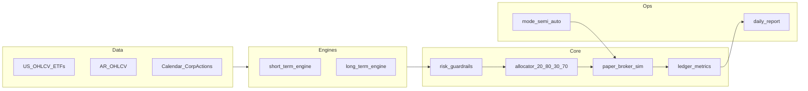

# Plan de ejecución: bot moderado (paper-first)

## Contexto del repo

Hoy el proyecto solo tiene documentación en [knowledge-base/youtube-sPhZqKYUFLQ-polymarket-wallet-scanner-polycup.md](knowledge-base/youtube-sPhZqKYUFLQ-polymarket-wallet-scanner-polycup.md), [knowledge-base/youtube-tsCI72TWzsg-claude-telegram-trading-assistant.md](knowledge-base/youtube-tsCI72TWzsg-claude-telegram-trading-assistant.md) y [knowledge-base/youtube-ksw6HAPF71o-ia-carteras-autopilot-lopez-lira.md](knowledge-base/youtube-ksw6HAPF71o-ia-carteras-autopilot-lopez-lira.md). Esas notas se traducen en **reglas de producto**: riesgo duro antes que LLM, logging/auditoría, control de concentración y turnover, y uso de IA como **copiloto** (resúmenes, clasificación, no caja negra de ejecución).

## Arquitectura objetivo

- **Datos reales**: conectores por mercado (US vía fuente con licencia/API estable; AR vía proveedor que elijas en Fase 1). Normalizar a un esquema común (`symbol`, `ts`, `open/high/low/close/volume`, `currency`, `venue`).
- **Dos motores**: `short_term_engine` (señales diarias, universo acciones + ETFs índice US + acciones AR permitidas) y `long_term_engine` (core pasivo + satélite, rebalanceo mensual). Salida de cada motor: **órdenes intent** (no ejecución directa).
- **Núcleo único**: `risk_guardrails` + `allocator` (30/70 y 20/80 con rebalanceo por bandas) + `paper_broker_sim` (llenado, slippage, comisiones) + `ledger` (equity, PnL, drawdown mensual del bucket corto).
- **Modo conmutable**: flag de configuración `execution_mode: semi_auto | auto`; en semi, las órdenes quedan en cola hasta aprobación (archivo/CLI/Telegram en fase posterior).

## Fase 1 — Especificación del sistema

1. **Documento de política** (un solo `POLICY.md` o equivalente en repo): umbrales por perfil moderado — max % por ticker, max sector, max pérdida diaria/mensual *por bucket* (corto vs total), lista blanca de símbolos US (ETFs SPY/QQQ/IWM + acciones) y AR, y reglas de **no trading** (ej. ventana de noticias si las incorporás después).
2. **Contrato de configuración versionada** (YAML): `profile: moderate`, `weights: {short: 0.30, long: 0.70}`, `geo: {AR: 0.20, US: 0.80}`, `short_kill_switch_monthly_dd: -0.08`, `cadence: {short: daily, long: monthly}`, `execution_mode`.
3. **Matriz de riesgo** explícita: qué pasa si se viola un límite (rechazar orden, recortar tamaño, pausar motor corto).
4. **Mapa de dependencias de datos**: qué campos mínimos exige cada motor y qué hace el sistema si falta liquidez o hay gap en series.

## Fase 2 — Motor de simulación realista (core)

1. **Event engine / backtester**: barra diaria inicialmente; cola de eventos `MarketOpen` → `SignalGenerated` → `OrdersProposed` → `RiskChecked` → `OrdersFilled` → `LedgerUpdated`.
2. **Corporate actions y calendario**: al menos splits/dividendos para US en v1 (aunque sea vía tabla auxiliar); calendario de sesiones US y días hábiles AR (definir fuente única de verdad).
3. **Modelo de costos**: comisión por lado, slippage en bps o función de volumen relativo al ADV, spread mínimo opcional; **todo configurable** por mercado.
4. **Ledger**: cash, posiciones, valoración MTM, PnL realizado/no realizado, equity curve, **drawdown mensual del subportfolio corto** para el kill switch.
5. **Paper broker**: sin API real; implementa la misma interfaz que usará el broker real (`place_order`, `get_positions`) para no reescribir motores.

## Fase 3 — Estrategias por bloque

1. **`short_term_engine` (30% del capital objetivo)**  
   - Señal diaria simple y auditable en v1: por ejemplo momentum de N días + filtro de volatilidad/liquidez (percentil de volumen), con **tamaño** derivado del riesgo por trade (ej. fracción de vol objetivo).  
   - Universo: acciones AR/US permitidas + ETFs de índice US; **sin apalancamiento** en v1 salvo que lo documentes aparte.

2. **`long_term_engine` (70%)**  
   - **Core pasivo**: pesos objetivo en 2–3 ETFs US (broad market).  
   - **Satélite**: pocas líneas de convicción con tope de peso y revisión mensual.  
   - **Rebalanceo mensual** con tolerancia por bandas (ej. drift > X pp antes de operar) para contener turnover.

3. **`allocator`**  
   - Aplica simultáneamente **30/70** (corto/largo) y **20/80** (AR/US) dentro del total, con correcciones cuando un bucket no puede llenarse (falta de liquidez) — regla documentada (ej. redistribuir al hermano geográfico del mismo horizonte).

## Fase 4 — Gestión de riesgo y perfiles

1. **Guardrails determinísticos** (código, no LLM): max notional por ticker, max suma por sector, límites de pérdida diaria/mensual por motor, cooldown tras racha de pérdidas si lo definís en política.
2. **Kill switch**: si drawdown mensual del **módulo corto** ≤ **-8%**, congelar solo `short_term_engine` hasta fin de mes o hasta reset manual (documentar cuál de las dos).
3. **Modo semi vs auto**: misma pipeline; en semi, persistir `pending_orders` y exigir confirmación; en auto, ejecutar si pasa riesgo.
4. **Observabilidad**: logs estructurados (JSON) por ciclo: inputs de señal, decisión de riesgo, fills simulados, PnL y estado del kill switch.

## Fase 5 — Validación estadística y gate a producción

1. **Walk-forward**: entrenamiento de hiperparámetros solo en ventana in-sample; validación en tramos out-of-sample consecutivos.
2. **KPIs mínimos** (tabla en informe automático): retorno neto anualizado, Sharpe, Sortino, max drawdown, Calmar, hit rate, profit factor, turnover, costo total por estrategia, alpha vs benchmark mixto (ponderado 20/80), drift vs objetivos 30/70 y 20/80.
3. **Criterio de paso**: definir umbrales numéricos *antes* de mirar resultados (evita p-hacking); si no pasan, no se sube capital.
4. **Ramp-up a real**: 10% → 25% → 50% → 100% del capital asignado al bot, con revisión en cada escalón.

## Entregables por hito (orden sugerido)

| Hito | Entregable |
|------|----------------|
| H1 | Config YAML + `POLICY.md` + tests de parsing |
| H2 | `paper_broker_sim` + ledger + métricas básicas + test de costos |
| H3 | `long_term_engine` + rebalanceo mensual + informe |
| H4 | `short_term_engine` + kill switch -8% mensual + tests |
| H5 | Notebooks o script de walk-forward + plantilla de informe KPI |
| H6 | (Opcional) capa IA solo lectura: resume riesgos y drift sin ejecutar |

## Riesgos y mitigaciones

- **Datos AR**: calidad y alineación horaria; mitigar con proveedor explícito y validaciones de outliers.
- **Sobreajuste del corto**: mitigar con walk-forward, penalizar turnover en KPIs, mantener estrategia simple en v1.
- **Sesgo de supervivencia** (de la KB): no inferir alpha de carteras “virales”; el gate es estadístico + costos + régimen.

## Nota legal/operativa

Este plan es **educativo y de ingeniería**; cumplimiento fiscal, regulación local y términos de cada broker/API quedan fuera del código y deben revisarse con asesor calificado antes de operar en vivo.
