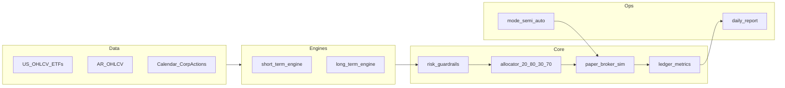

# Plan de ejecución: bot moderado (paper-first)

## Contexto del repo

Hoy el proyecto solo tiene documentación en [knowledge-base/youtube-sPhZqKYUFLQ-polymarket-wallet-scanner-polycup.md](knowledge-base/youtube-sPhZqKYUFLQ-polymarket-wallet-scanner-polycup.md), [knowledge-base/youtube-tsCI72TWzsg-claude-telegram-trading-assistant.md](knowledge-base/youtube-tsCI72TWzsg-claude-telegram-trading-assistant.md) y [knowledge-base/youtube-ksw6HAPF71o-ia-carteras-autopilot-lopez-lira.md](knowledge-base/youtube-ksw6HAPF71o-ia-carteras-autopilot-lopez-lira.md). Esas notas se traducen en **reglas de producto**: riesgo duro antes que LLM, logging/auditoría, control de concentración y turnover, y uso de IA como **copiloto** (resúmenes, clasificación, no caja negra de ejecución).

## Arquitectura objetivo

- **Datos reales**: conectores por mercado (US vía fuente con licencia/API estable; AR vía proveedor que elijas en Fase 1). Normalizar a un esquema común (`symbol`, `ts`, `open/high/low/close/volume`, `currency`, `venue`).
- **Dos motores**: `short_term_engine` (señales diarias, universo acciones + ETFs índice US + acciones AR permitidas) y `long_term_engine` (core pasivo + satélite, rebalanceo mensual). Salida de cada motor: **órdenes intent** (no ejecución directa).
- **Núcleo único**: `risk_guardrails` + `allocator` (30/70 y 20/80 con rebalanceo por bandas) + `paper_broker_sim` (llenado, slippage, comisiones) + `ledger` (equity, PnL, drawdown mensual del bucket corto).
- **Modo conmutable**: flag de configuración `execution_mode: semi_auto | auto`; en semi, las órdenes quedan en cola hasta aprobación (archivo/CLI/Telegram en fase posterior).

## Fase 1 — Especificación del sistema (COMPLETADA)

1. **Documento de política** (un solo `POLICY.md` o equivalente en repo): umbrales por perfil moderado — max % por ticker, max sector, max pérdida diaria/mensual *por bucket* (corto vs total), lista blanca de símbolos US (ETFs SPY/QQQ/IWM + acciones) y AR, y reglas de **no trading** (ej. ventana de noticias si las incorporás después).
2. **Contrato de configuración versionada** (YAML): `profile: moderate`, `weights: {short: 0.30, long: 0.70}`, `geo: {AR: 0.20, US: 0.80}`, `short_kill_switch_monthly_dd: -0.08`, `cadence: {short: daily, long: monthly}`, `execution_mode`.
3. **Matriz de riesgo** explícita: qué pasa si se viola un límite (rechazar orden, recortar tamaño, pausar motor corto).
4. **Mapa de dependencias de datos**: qué campos mínimos exige cada motor y qué hace el sistema si falta liquidez o hay gap en series.

## Fase 2 — Motor de simulación realista (core) (COMPLETADA)

1. **Event engine / backtester**: barra diaria inicialmente; cola de eventos `MarketOpen` → `SignalGenerated` → `OrdersProposed` → `RiskChecked` → `OrdersFilled` → `LedgerUpdated`.
2. **Corporate actions y calendario**: al menos splits/dividendos para US en v1 (aunque sea vía tabla auxiliar); calendario de sesiones US y días hábiles AR (definir fuente única de verdad).
3. **Modelo de costos**: comisión por lado, slippage en bps o función de volumen relativo al ADV, spread mínimo opcional; **todo configurable** por mercado.
4. **Ledger**: cash, posiciones, valoración MTM, PnL realizado/no realizado, equity curve, **drawdown mensual del subportfolio corto** para el kill switch.
5. **Paper broker**: sin API real; implementa la misma interfaz que usará el broker real (`place_order`, `get_positions`) para no reescribir motores.

## Fase 3 — Estrategias por bloque (COMPLETADA)

1. **`short_term_engine` (30% del capital objetivo)**  
   - **Propuesta v1 (auditable y determinística):** score por activo = momentum `N` días (retorno acumulado) filtrado por liquidez (percentil de volumen `>= p_min`) y volatilidad (`vol_20d <= vol_max`). Solo entra al ranking lo que pasa filtros.  
   - **Regla de selección:** tomar top `K` del ranking por mercado respetando whitelist y límites de concentración; sin señal discrecional ni prompts.  
   - **Sizing por riesgo:** notional por trade = `risk_budget_trade / vol_20d`, capado por `max_position_pct`, `max_sector_pct` y cash disponible del bucket corto; redondeo a lotes mínimos por mercado.  
   - **Universo v1:** acciones AR/US permitidas + ETFs índice US; **sin apalancamiento** ni derivados en v1 salvo documento explícito de excepción.
   - **Contrato I/O:** entrada = snapshot diario normalizado (`symbol`, `close`, `volume`, `currency`, calendario válido) + estado de portfolio; salida = `orders_intent[]` con `symbol`, `side`, `qty`, `reason_code`, `signal_score`, `risk_snapshot`.
   - **Fallbacks obligatorios:** si falta dato crítico (precio/volumen/calendario) o no pasa liquidez, no se opera ese símbolo y se registra `skip_reason` en log estructurado.
   - **Validación mínima pre-gate:** backtest walk-forward del bloque corto con costos, turnover y DD mensual; rechazo automático si no cumple umbrales definidos en política. *(Implementado: `core_sim/short_term_pre_gate.py`, `config/policy.v1.yaml` → `short_term_pre_gate`, `scripts/run_short_term_pre_gate.py`, tests `tests/test_short_term_pre_gate.py`.)*
   - **Agent-teams-lite + SDD flow (este bloque):**
     - `Spec/policy`: definir parámetros (`N`, `p_min`, `vol_max`, `K`, límites por ticker/sector) en `POLICY.md` + `config/policy.v1.yaml`.
     - `Data`: garantizar columnas requeridas, manejo de faltantes y calendario AR/US consistente.
     - `Engines`: implementar cálculo de score, ranking y generación de `orders_intent`.
     - `Risk`: integrar caps de sizing, kill switch del bucket corto y matriz de violaciones.
     - `Core sim`: validar que `orders_intent` sean consumibles por `paper_broker_sim` sin lógica duplicada.
     - `QA/CI`: tests unitarios (score/sizing/filtros) + integración (evento diario completo) + test de no-operación ante datos incompletos.

2. **`long_term_engine` (70% del capital objetivo; los pesos dentro del sleeve largo suman 100%)**  
   - **Core pasivo (ETFs US broad market)**: 2–3 símbolos con **pesos objetivo explícitos** en `POLICY.md` + YAML; criterio documentado de baja redundancia (p. ej. mercado US total vs factor/size si aplica).  
   - **Satélite**: lista acotada con **`max_satellite_weight_total`**, **`max_weight_per_satellite_line`** y **`max_satellite_names`** (entero); revisión solo en **fecha de rebalance mensual** (cambios off-cycle solo con procedimiento manual documentado).  
   - **Calendario de rebalanceo**: regla inequívoca (p. ej. **primer día hábil US del mes** u otro día T); si **halt**, datos incompletos o sesión inválida → **no operar** ese ciclo y log estructurado (mismo espíritu que el corto).  
   - **Bandas anti-turnover**: parámetro único **`drift_rebalance_threshold_pp`** (puntos porcentuales) definido por **línea** *o* por **agregado core** (elegir una convención en política para no doble-contar); solo se emiten órdenes si **fecha de rebalance** ∧ **algún drift supera umbral**.  
   - **Corporate actions**: antes de calcular pesos, **ajustar posiciones** con el pipeline v1 de splits/dividendos ya previsto en Fase 2 (evita rebalanceos “fantasma”).  
   - **Contrato I/O**: entrada = snapshot OHLCV normalizado + posiciones/MTM del sleeve largo (o estado ledger equivalente); salida = `orders_intent[]` con `reason_code` dedicados (p. ej. `long_rebalance_core`, `long_satellite_trim`, `long_satellite_add`), `target_weight`, `current_weight`, `drift_pp`, `risk_snapshot`.  
   - **Límites de riesgo**: caps de notional por trade de rebalanceo opcionales (`max_long_rebalance_turnover_pct` del sleeve) y respeto de whitelist; el motor **no** recalcula 30/70 ni 20/80 — eso queda en **`allocator`**.  
   - **Agent-teams-lite + SDD (este bloque)** — ver sección *SDD — change `engine-long-v1`* al final del documento:
     - `Spec/policy`: sección largo en `POLICY.md`, claves `long_term` en YAML + `policy.v1.schema.json` + tests de parsing.
     - `Data`: columnas mínimas, calendario US, faltantes → `skip_reason`.
     - `Engines`: funciones puras (target, actual, drift, disparador) + generador de intents.
     - `Risk`: concentración satélite, turnover de rebalanceo, interacción con guardrails globales.
     - `Core sim`: un ciclo `MarketOpen` mensual que consuma intents en `paper_broker_sim` sin duplicar lógica del allocator.
     - `QA/CI`: tests unitarios de bandas + integración con evento de split en ETF core.

3. **`allocator`**  
   - Aplica simultáneamente **30/70** (corto/largo) y **20/80** (AR/US) dentro del total, con correcciones cuando un bucket no puede llenarse (falta de liquidez) — regla documentada (ej. redistribuir al hermano geográfico del mismo horizonte).

## Fase 4 — Gestión de riesgo y perfiles (COMPLETADA)

1. **Guardrails determinísticos** (código, no LLM): max notional por ticker, max suma por sector, límites de pérdida diaria/mensual por motor, cooldown tras racha de pérdidas si lo definís en política.
2. **Kill switch**: si drawdown mensual del **módulo corto** ≤ **-8%**, congelar solo `short_term_engine` hasta fin de mes o hasta reset manual (documentar cuál de las dos).
3. **Modo semi vs auto**: misma pipeline; en semi, persistir `pending_orders` y exigir confirmación; en auto, ejecutar si pasa riesgo.
4. **Observabilidad**: logs estructurados (JSON) por ciclo: inputs de señal, decisión de riesgo, fills simulados, PnL y estado del kill switch.

## Fase 5 — Validación estadística y gate a producción

1. **Walk-forward**: entrenamiento de hiperparámetros solo en ventana in-sample; validación en tramos out-of-sample consecutivos.
2. **Informe KPI (tabla única automatizada)** — *misma corrida/resumen ejecutable reproducible*. Objetivo: evitar métricas “bonitas pero incomparables” y dejar cada número **definido antes** de mirar resultados.

   **Segmentación obligatoria** (filas repetidas por KPI o multi-column): **total**, bucket **corto** (~30%), bucket **largo** (~70%). Donde aplique geo, opcional pero recomendado: sub-bloques **AR/US** para interpretar drift y alpha con la misma base contable que el allocator.

   **Benchmark mixto** (para *alpha*, no para Sharpe obligatorio si no lo definís): cartera sintética con **los mismos pesos 20/80** acordados *antes del run*, componentes públicos reproducibles documentados en `POLICY`/anexo del informe (no reoptimizar el benchmark al ver el equity del bot). Retorno en moneda de consolidación del informe (una sola; documentar FX de referencia para AR).

   **KPIs mínimos** (checklist; ampliar solo con versión de informe `rpt_kpi.v1` si rompe contrato):

   | Bloque | KPI | Notas de definición (fijar en spec antes de correr) |
   |--------|-----|-----------------------------------------------------|
   | Retorno | Retorno neto anualizado | Sobre curva de **equity** del segmento; neto = después de costos simulados; annualizar con convención explícita (ej. 252 días hábiles). |
   | Riesgo / retorno | Sharpe | Tasa libre de riesgo `r_f` y periodicidad (diaria) fijadas **antes**; si `r_f` = 0 en paper, declararlo. |
   | Colas | Sortino | Umbral de retorno objetivo (típico 0 o `r_f`); desviación downside en la misma periodicidad que Sharpe. |
   | Drawdown | Max drawdown (ventana OOS o tramo reportado) | Pico a valle sobre equity del segmento; declarar si incluye o no cash no asignado. |
   | Calidad largo | `MDD_12m` **rolling** y `Calmar_12m` | Ventana 12 meses / 252 sesiones deslizante sobre equity **solo del largo**; Calmar = retorno anualizado del tramo / \|MDD del tramo\| con regla para MDD≈0. |
   | Ejecución | Hit rate | Unidad fija: **por trade cerrado** *o* **por día** — elegir una y no mezclar entre runs. |
   | Ejecución | Profit factor | Suma ganancias / suma pérdidas (valor absoluto) en la misma unidad que hit rate. |
   | Fricción | Turnover | Convención única (ej. mitad del sumatorio de \|Δposición\| valorizada / patrimonio medio del segmento en el mes); reportar **mensual** para el largo (`turnover_long_monthly`) y agregado/total según política. |
   | Costos | Costo total por motor | Comisiones + slippage (y otros del `cost_model`) atribuibles a **corto** vs **largo** según tag de orden o motor en ledger. |
   | Mandato | Drift vs 30/70 y 20/80 | Diferencia en **puntos porcentuales** entre peso **real** MTM y target de política; bandas `±X pp` documentadas; no “optimizar” X mirando el historial del bot. |
   | Benchmark | Alpha vs mix 20/80 | Retorno neto del segmento (o total) menos retorno del benchmark **misma ventana, misma moneda**; opcional: tracking error / beta vs benchmark si se desea segunda fila. |

   **Tareas chicas (orden sugerido para implementar de a poco)**

   1. **Spec de informe** (`docs/` o bloque en `POLICY.md`): tabla anterior con *una* decisión cerrada por fila ambigua (`r_f`, unidad hit rate, fórmula turnover, FX). Fecha de congelación (“válido hasta revisión”).
   2. **Contrato de salida Ledger**: garantizar exportable **serie diaria** de equity (y opcional NAV por bucket/geo) desde el ledger o dump post-backtest; columnas `ts`, `equity_total`, `equity_short`, `equity_long`, `cash`, `costs_day`.
   3. **Tabla benchmark estática**: YAML o CSV con símbolos y pesos 20/80 + función que descargue/lea retornos y alinee fechas al backtest (sin lookahead).
   4. **`scripts/report_kpis.py` (v0)**: lee CSV de equity + trades → escribe JSON/Markdown con solo retorno neto anualizado, max DD y costos por motor (Smoke test).
   5. **v1**: añadir Sharpe, Sortino, hit rate, profit factor desde log de fills (tests con serie sintética conocida).
   6. **v2**: drift 30/70 y 20/80 en cada fecha de snapshot (último día del tramo OOS + serie si se desea gráfico); bandas comparadas sin acción automática en el script (solo informe).
   7. **v3**: `MDD_12m` + `Calmar_12m` + `turnover_long_monthly` en el bloque largo; alpha vs benchmark mixto alineado.
   8. **Walk-forward**: bucle que invoque v3 por tramo OOS y consolide tabla maestra + “pass/fail” contra umbrales del punto 3.
   9. **CI mínimo**: test de regresión en KPIs con dataset de 60 días fijo en `tests/fixtures/` (golden values).

3. **Criterio de paso (gate)** antes de más capital (paper-first → ramp real):

   - Redactar **lista cerrada de umbrales** (ej. Sharpe OOS ≥ …, Sortino ≥ …, max DD corto/largo ≤ …, drift máximo medio ≤ … pp, turnover largo dentro de banda razonable predefinida, alpha vs benchmark ≥ … **o** “no inferior por más de Δ”, etc.) **antes** del primer resultado OOS aggregate.
   - Registrarlos en `POLICY`/anexo numerado **con fecha**; cualquier cambio posterior exige nueva versión y motivo (“no tirar hasta acertar”).
   - Regla práctica: un tramo puede fallar por shock; política opcional tipo “K de últimos Q tramos OOS pasan gate” para no depender de un solo mes.

4. **Ramp-up a real**: 10% → 25% → 50% → 100% del capital asignado al bot, con revisión en cada escalón.

## Entregables por hito (orden sugerido)

| Hito | Entregable |
|------|----------------|
| H1 | Config YAML + `POLICY.md` + tests de parsing |
| H2 | `paper_broker_sim` + ledger + métricas básicas + test de costos |
| H3 | `long_term_engine` — policy/YAML largo, drift+bandas, intents mensuales, integración backtester, tests + mini-informe de drift/turnover del sleeve |
| H4 | `short_term_engine` + kill switch -8% mensual + tests |
| H5 | Script walk-forward + `report_kpis` (v0→v3) + fixtures de KPI en CI + anexo umbrales pre-registro |
| H6 | (Opcional) capa IA solo lectura: resume riesgos y drift sin ejecutar |

## Riesgos y mitigaciones

- **Datos AR**: calidad y alineación horaria; mitigar con proveedor explícito y validaciones de outliers.
- **Sobreajuste del corto**: mitigar con walk-forward, penalizar turnover en KPIs, mantener estrategia simple en v1.
- **Sesgo de supervivencia** (de la KB): no inferir alpha de carteras “virales”; el gate es estadístico + costos + régimen.

## Nota legal/operativa

Este plan es **educativo y de ingeniería**; cumplimiento fiscal, regulación local y términos de cada broker/API quedan fuera del código y deben revisarse con asesor calificado antes de operar en vivo.

## SDD — change `engine-short-v1`

### Proposal (Checkpoint #1 aprobado)

- **Problema**: el bloque de `short_term_engine` estaba definido a alto nivel y dejaba ambigüedad de implementación (señal, sizing, fallbacks, criterios de aceptación).
- **Enfoque**: fijar una versión v1 mínima, totalmente auditable y determinística, que produzca `orders_intent` desacopladas de ejecución y compatible con `risk_guardrails` + `paper_broker_sim`.
- **Módulos impactados**: `POLICY.md`, `config/policy.v1.yaml`, `core_sim/paper_broker_sim.py`, nuevo módulo de engine corto, tests de engine/riesgo/eventos.
- **Riesgos**: sobreajuste por tuning de parámetros, falsos positivos por datos incompletos, drift de buckets si falta liquidez.

### Spec (requisitos ejecutables)

1. El engine debe operar solo con símbolos de whitelist AR/US y ETFs US permitidos.
2. Debe calcular `signal_score` diario por símbolo usando momentum `N` y filtros de liquidez/volatilidad.
3. Debe excluir símbolos con datos faltantes o calendario inválido y registrar `skip_reason`.
4. Debe seleccionar máximo `K` símbolos por corrida diaria siguiendo ranking descendente de score.
5. Debe generar solo `orders_intent` (sin ejecución directa), con trazabilidad de señal y snapshot de riesgo.
6. Debe aplicar sizing por riesgo con caps por ticker/sector y efectivo disponible del bucket corto.
7. Debe respetar kill switch del bucket corto antes de emitir nuevas órdenes.
8. Debe exponer métricas mínimas del ciclo: símbolos evaluados, filtrados, ordenados y motivo de descarte.

### Design (contrato y decisiones técnicas)

- **Input data contract**: `symbol`, `ts`, `close`, `volume`, `currency`, `venue`, bandera de sesión válida.
- **Output contract** (`orders_intent[]`):
  - `symbol`, `side`, `qty`, `intent_notional`
  - `reason_code` (`signal_entry`, `rebalance_reduce`, `risk_trim`)
  - `signal_score`, `risk_snapshot`, `created_at`
- **Pipeline diaria**:
  1. Validar universo + calendario.
  2. Calcular features (`ret_N`, `vol_20d`, percentil de volumen).
  3. Filtrar por umbrales (`p_min`, `vol_max`).
  4. Rankear y seleccionar top `K`.
  5. Dimensionar posición por riesgo.
  6. Pasar por guardrails/kill switch.
  7. Emitir `orders_intent` + logs estructurados.
- **Principio de seguridad**: ante duda de datos o conflicto de límites, el engine no opera.

### Tasks (Checkpoint #2)

#### Fase A — Spec/Policy (complejidad: baja-media)

- [ ] Parametrizar `N`, `p_min`, `vol_max`, `K`, `risk_budget_trade` y caps en `config/policy.v1.yaml`.
- [ ] Sincronizar `POLICY.md` con el YAML (mismos umbrales y matriz de violaciones).

#### Fase B — Engine/Data (complejidad: media)

- [ ] Implementar funciones puras de cálculo de score y filtros (sin side effects).
- [ ] Implementar generador de `orders_intent` con contrato estable.
- [ ] Añadir manejo explícito de datos faltantes y `skip_reason`.

#### Fase C — Riesgo/Core sim (complejidad: media)

- [ ] Integrar caps de sizing y validación de kill switch previo a órdenes.
- [ ] Verificar compatibilidad `orders_intent` -> `paper_broker_sim` sin lógica duplicada.

#### Fase D — QA/CI (complejidad: media)

- [ ] Tests unitarios de score, ranking, filtros, sizing y redondeo por lotes.
- [ ] Test de integración del evento diario completo (`SignalGenerated` -> `OrdersProposed` -> `RiskChecked`).
- [ ] Test negativo: no generar órdenes con datos críticos faltantes.

## SDD — change `engine-long-v1`

### Proposal

- **Problema**: el bloque `long_term_engine` estaba en tres viñetas; faltaban contrato de config, regla de calendario, semántica de bandas, interacción con allocator y criterios de QA.
- **Enfoque**: v1 **determinística y auditable**: pesos objetivo dentro del sleeve 70%, rebalanceo mensual condicionado por **bandas**, satélite acotado, intents desacoplados de ejecución, reutilización de corporate actions y misma tubería riesgo → broker que el corto.
- **Módulos impactados**: `POLICY.md`, `config/policy.v1.yaml`, `config/policy.v1.schema.json`, nuevo módulo `long_term_engine` (o rutas bajo `core_sim/`), `DailyEventBacktester` / runner mensual, tests.
- **Riesgos**: doble aplicación de 30/70 si el engine largo mezcla capital total; ambigüedad drift por línea vs agregado; datos faltantes en ETF core el día de rebalance.

### Spec (requisitos ejecutables)

1. Pesos objetivo **core + satélite** viven en config y suman 100% **del sleeve largo** (no del portfolio total).
2. Solo símbolos en whitelist US (y reglas AR si el satélite incluye AR — si no, explícitamente “satélite solo US” en política).
3. El motor calcula **drift** entre peso objetivo y peso actual MTM por la convención elegida (línea o agregado core) y compara con `drift_rebalance_threshold_pp`.
4. Solo en **día de rebalance mensual** puede emitir órdenes; además debe existir al menos un drift que supere el umbral (salvo política explícita de “forzar alineación” — v1 recomienda no forzar si todo está dentro de banda).
5. Salida exclusivamente `orders_intent[]` con campos de trazabilidad (`target_weight`, `current_weight`, `drift_pp`, `reason_code`).
6. Ante precio faltante o calendario inválido para un símbolo afectado: **no** generar orden para ese símbolo y registrar `skip_reason` (o abortar todo el ciclo largo — una sola política documentada).
7. El motor **no** implementa split 30/70 ni 20/80; asume **notional del bucket largo** ya resuelto por el allocator o recibe `long_bucket_cash_notional` como input de ciclo (documentar cuál v1 en diseño).

### Design (contrato y decisiones técnicas)

- **Input**: snapshot diario/mensual alineado al corto (`symbol`, `ts`, `close`, `volume`, …) + estado de posiciones del sleeve largo + **fecha de sesión** + config `long_term`.
- **Output** (`orders_intent[]`): extensión del contrato corto con `reason_code` del conjunto largo; sin `signal_score` salvo que se defina un score trivial “n/a” para unificar schema.
- **Pipeline mensual**:
  1. ¿Es día de rebalance según calendario US?
  2. Aplicar corporate actions a posiciones si el store tiene eventos pendientes.
  3. Calcular pesos actuales MTM y drift vs objetivo.
  4. Si no hay brecha de banda → fin (sin órdenes).
  5. Generar intents (compras/ventas) minimizando número de patas (opcional v2: optimizador; v1 puede ser proporcional simple).
  6. Pasar por `risk_guardrails` → `allocator`/`paper_broker_sim` como el resto del sistema.
- **Principio de seguridad**: ante duda de datos o suma de pesos objetivo ≠ 100% del sleeve, el engine no opera y loguea error de configuración.

### Tasks (Checkpoint)

#### Fase A — Spec/Policy (complejidad: baja-media)

- [ ] Definir en `POLICY.md` universo core, satélite, topes, convención de drift y día de rebalance.
- [ ] Añadir `long_term:` en `config/policy.v1.yaml` y validar con `policy.v1.schema.json` + tests de parsing.

#### Fase B — Engine/Data (complejidad: media)

- [ ] Implementar cálculo de pesos actuales y drift (funciones puras + tests).
- [ ] Implementar `should_rebalance_long` (calendario ∧ bandas).
- [ ] Implementar generador de `orders_intent` con `skip_reason` en datos incompletos.

#### Fase C — Riesgo/Core sim (complejidad: media)

- [ ] Integrar ciclo mensual en el event engine o runner dedicado (reutilizar `MarketOpen` con flag de motor).
- [ ] Verificar que intents largos consuman el mismo path que los cortos hasta el fill simulado.

#### Fase D — QA/CI (complejidad: media)

- [ ] Test: dentro de banda en día de rebalance → cero órdenes.
- [ ] Test: fuera de banda en día de rebalance → órdenes esperadas (dirección y magnitud acotadas).
- [ ] Test de integración: split en ETF core antes del rebalance no produce qty erróneas.
