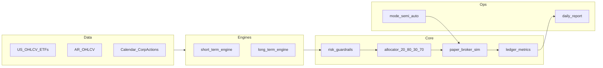

# Plan de ejecución: bot moderado (paper-first)

## Contexto del repo

Hoy el proyecto solo tiene documentación en [knowledge-base/youtube-sPhZqKYUFLQ-polymarket-wallet-scanner-polycup.md](knowledge-base/youtube-sPhZqKYUFLQ-polymarket-wallet-scanner-polycup.md), [knowledge-base/youtube-tsCI72TWzsg-claude-telegram-trading-assistant.md](knowledge-base/youtube-tsCI72TWzsg-claude-telegram-trading-assistant.md) y [knowledge-base/youtube-ksw6HAPF71o-ia-carteras-autopilot-lopez-lira.md](knowledge-base/youtube-ksw6HAPF71o-ia-carteras-autopilot-lopez-lira.md). Esas notas se traducen en **reglas de producto**: riesgo duro antes que LLM, logging/auditoría, control de concentración y turnover, y uso de IA como **copiloto** (resúmenes, clasificación, no caja negra de ejecución).

## Arquitectura objetivo

- **Datos reales**: conectores por mercado (US vía fuente con licencia/API estable; AR vía proveedor que elijas en Fase 1). Normalizar a un esquema común (`symbol`, `ts`, `open/high/low/close/volume`, `currency`, `venue`).
- **Dos motores**: `short_term_engine` (señales diarias, universo acciones + ETFs índice US + acciones AR permitidas) y `long_term_engine` (core pasivo + satélite, rebalanceo mensual). Salida de cada motor: **órdenes intent** (no ejecución directa).
- **Núcleo único**: `risk_guardrails` + `allocator` (30/70 y 20/80 con rebalanceo por bandas) + `paper_broker_sim` (llenado, slippage, comisiones) + `ledger` (equity, PnL, drawdown mensual del bucket corto).
- **Modo conmutable**: flag de configuración `execution_mode: semi_auto | auto`; en semi, las órdenes quedan en cola hasta aprobación (archivo/CLI/Telegram en fase posterior).

## Fase 1 — Especificación del sistema

1. **Documento de política** (un solo `POLICY.md` o equivalente en repo): umbrales por perfil moderado — max % por ticker, max sector, max pérdida diaria/mensual *por bucket* (corto vs total), lista blanca de símbolos US (ETFs SPY/QQQ/IWM + acciones) y AR, y reglas de **no trading** (ej. ventana de noticias si las incorporás después).
2. **Contrato de configuración versionada** (YAML): `profile: moderate`, `weights: {short: 0.30, long: 0.70}`, `geo: {AR: 0.20, US: 0.80}`, `short_kill_switch_monthly_dd: -0.08`, `cadence: {short: daily, long: monthly}`, `execution_mode`.
3. **Matriz de riesgo** explícita: qué pasa si se viola un límite (rechazar orden, recortar tamaño, pausar motor corto).
4. **Mapa de dependencias de datos**: qué campos mínimos exige cada motor y qué hace el sistema si falta liquidez o hay gap en series.

## Fase 2 — Motor de simulación realista (core)

1. **Event engine / backtester**: barra diaria inicialmente; cola de eventos `MarketOpen` → `SignalGenerated` → `OrdersProposed` → `RiskChecked` → `OrdersFilled` → `LedgerUpdated`.
2. **Corporate actions y calendario**: al menos splits/dividendos para US en v1 (aunque sea vía tabla auxiliar); calendario de sesiones US y días hábiles AR (definir fuente única de verdad).
3. **Modelo de costos**: comisión por lado, slippage en bps o función de volumen relativo al ADV, spread mínimo opcional; **todo configurable** por mercado.
4. **Ledger**: cash, posiciones, valoración MTM, PnL realizado/no realizado, equity curve, **drawdown mensual del subportfolio corto** para el kill switch.
5. **Paper broker**: sin API real; implementa la misma interfaz que usará el broker real (`place_order`, `get_positions`) para no reescribir motores.

## Fase 3 — Estrategias por bloque

1. **`short_term_engine` (30% del capital objetivo)**  
   - **Propuesta v1 (auditable y determinística):** score por activo = momentum `N` días (retorno acumulado) filtrado por liquidez (percentil de volumen `>= p_min`) y volatilidad (`vol_20d <= vol_max`). Solo entra al ranking lo que pasa filtros.  
   - **Regla de selección:** tomar top `K` del ranking por mercado respetando whitelist y límites de concentración; sin señal discrecional ni prompts.  
   - **Sizing por riesgo:** notional por trade = `risk_budget_trade / vol_20d`, capado por `max_position_pct`, `max_sector_pct` y cash disponible del bucket corto; redondeo a lotes mínimos por mercado.  
   - **Universo v1:** acciones AR/US permitidas + ETFs índice US; **sin apalancamiento** ni derivados en v1 salvo documento explícito de excepción.
   - **Contrato I/O:** entrada = snapshot diario normalizado (`symbol`, `close`, `volume`, `currency`, calendario válido) + estado de portfolio; salida = `orders_intent[]` con `symbol`, `side`, `qty`, `reason_code`, `signal_score`, `risk_snapshot`.
   - **Fallbacks obligatorios:** si falta dato crítico (precio/volumen/calendario) o no pasa liquidez, no se opera ese símbolo y se registra `skip_reason` en log estructurado.
   - **Validación mínima pre-gate:** backtest walk-forward del bloque corto con costos, turnover y DD mensual; rechazo automático si no cumple umbrales definidos en política.
   - **Agent-teams-lite + SDD flow (este bloque):**
     - `Spec/policy`: definir parámetros (`N`, `p_min`, `vol_max`, `K`, límites por ticker/sector) en `POLICY.md` + `config/policy.v1.yaml`.
     - `Data`: garantizar columnas requeridas, manejo de faltantes y calendario AR/US consistente.
     - `Engines`: implementar cálculo de score, ranking y generación de `orders_intent`.
     - `Risk`: integrar caps de sizing, kill switch del bucket corto y matriz de violaciones.
     - `Core sim`: validar que `orders_intent` sean consumibles por `paper_broker_sim` sin lógica duplicada.
     - `QA/CI`: tests unitarios (score/sizing/filtros) + integración (evento diario completo) + test de no-operación ante datos incompletos.

2. **`long_term_engine` (70%)**  
   - **Core pasivo**: pesos objetivo en 2–3 ETFs US (broad market).  
   - **Satélite**: pocas líneas de convicción con tope de peso y revisión mensual.  
   - **Rebalanceo mensual** con tolerancia por bandas (ej. drift > X pp antes de operar) para contener turnover.

3. **`allocator`**  
   - Aplica simultáneamente **30/70** (corto/largo) y **20/80** (AR/US) dentro del total, con correcciones cuando un bucket no puede llenarse (falta de liquidez) — regla documentada (ej. redistribuir al hermano geográfico del mismo horizonte).

## Fase 4 — Gestión de riesgo y perfiles

1. **Guardrails determinísticos** (código, no LLM): max notional por ticker, max suma por sector, límites de pérdida diaria/mensual por motor, cooldown tras racha de pérdidas si lo definís en política.
2. **Kill switch**: si drawdown mensual del **módulo corto** ≤ **-8%**, congelar solo `short_term_engine` hasta fin de mes o hasta reset manual (documentar cuál de las dos).
3. **Modo semi vs auto**: misma pipeline; en semi, persistir `pending_orders` y exigir confirmación; en auto, ejecutar si pasa riesgo.
4. **Observabilidad**: logs estructurados (JSON) por ciclo: inputs de señal, decisión de riesgo, fills simulados, PnL y estado del kill switch.

## Fase 5 — Validación estadística y gate a producción

1. **Walk-forward**: entrenamiento de hiperparámetros solo en ventana in-sample; validación en tramos out-of-sample consecutivos.
2. **KPIs mínimos** (tabla en informe automático): retorno neto anualizado, Sharpe, Sortino, max drawdown, Calmar, hit rate, profit factor, turnover, costo total por estrategia, alpha vs benchmark mixto (ponderado 20/80), drift vs objetivos 30/70 y 20/80.
3. **Criterio de paso**: definir umbrales numéricos *antes* de mirar resultados (evita p-hacking); si no pasan, no se sube capital.
4. **Ramp-up a real**: 10% → 25% → 50% → 100% del capital asignado al bot, con revisión en cada escalón.

## Entregables por hito (orden sugerido)

| Hito | Entregable |
|------|----------------|
| H1 | Config YAML + `POLICY.md` + tests de parsing |
| H2 | `paper_broker_sim` + ledger + métricas básicas + test de costos |
| H3 | `long_term_engine` + rebalanceo mensual + informe |
| H4 | `short_term_engine` + kill switch -8% mensual + tests |
| H5 | Notebooks o script de walk-forward + plantilla de informe KPI |
| H6 | (Opcional) capa IA solo lectura: resume riesgos y drift sin ejecutar |

## Riesgos y mitigaciones

- **Datos AR**: calidad y alineación horaria; mitigar con proveedor explícito y validaciones de outliers.
- **Sobreajuste del corto**: mitigar con walk-forward, penalizar turnover en KPIs, mantener estrategia simple en v1.
- **Sesgo de supervivencia** (de la KB): no inferir alpha de carteras “virales”; el gate es estadístico + costos + régimen.

## Nota legal/operativa

Este plan es **educativo y de ingeniería**; cumplimiento fiscal, regulación local y términos de cada broker/API quedan fuera del código y deben revisarse con asesor calificado antes de operar en vivo.

## SDD — change `engine-short-v1`

### Proposal (Checkpoint #1 aprobado)

- **Problema**: el bloque de `short_term_engine` estaba definido a alto nivel y dejaba ambigüedad de implementación (señal, sizing, fallbacks, criterios de aceptación).
- **Enfoque**: fijar una versión v1 mínima, totalmente auditable y determinística, que produzca `orders_intent` desacopladas de ejecución y compatible con `risk_guardrails` + `paper_broker_sim`.
- **Módulos impactados**: `POLICY.md`, `config/policy.v1.yaml`, `core_sim/paper_broker_sim.py`, nuevo módulo de engine corto, tests de engine/riesgo/eventos.
- **Riesgos**: sobreajuste por tuning de parámetros, falsos positivos por datos incompletos, drift de buckets si falta liquidez.

### Spec (requisitos ejecutables)

1. El engine debe operar solo con símbolos de whitelist AR/US y ETFs US permitidos.
2. Debe calcular `signal_score` diario por símbolo usando momentum `N` y filtros de liquidez/volatilidad.
3. Debe excluir símbolos con datos faltantes o calendario inválido y registrar `skip_reason`.
4. Debe seleccionar máximo `K` símbolos por corrida diaria siguiendo ranking descendente de score.
5. Debe generar solo `orders_intent` (sin ejecución directa), con trazabilidad de señal y snapshot de riesgo.
6. Debe aplicar sizing por riesgo con caps por ticker/sector y efectivo disponible del bucket corto.
7. Debe respetar kill switch del bucket corto antes de emitir nuevas órdenes.
8. Debe exponer métricas mínimas del ciclo: símbolos evaluados, filtrados, ordenados y motivo de descarte.

### Design (contrato y decisiones técnicas)

- **Input data contract**: `symbol`, `ts`, `close`, `volume`, `currency`, `venue`, bandera de sesión válida.
- **Output contract** (`orders_intent[]`):
  - `symbol`, `side`, `qty`, `intent_notional`
  - `reason_code` (`signal_entry`, `rebalance_reduce`, `risk_trim`)
  - `signal_score`, `risk_snapshot`, `created_at`
- **Pipeline diaria**:
  1. Validar universo + calendario.
  2. Calcular features (`ret_N`, `vol_20d`, percentil de volumen).
  3. Filtrar por umbrales (`p_min`, `vol_max`).
  4. Rankear y seleccionar top `K`.
  5. Dimensionar posición por riesgo.
  6. Pasar por guardrails/kill switch.
  7. Emitir `orders_intent` + logs estructurados.
- **Principio de seguridad**: ante duda de datos o conflicto de límites, el engine no opera.

### Tasks (Checkpoint #2)

#### Fase A — Spec/Policy (complejidad: baja-media)

- [ ] Parametrizar `N`, `p_min`, `vol_max`, `K`, `risk_budget_trade` y caps en `config/policy.v1.yaml`.
- [ ] Sincronizar `POLICY.md` con el YAML (mismos umbrales y matriz de violaciones).

#### Fase B — Engine/Data (complejidad: media)

- [ ] Implementar funciones puras de cálculo de score y filtros (sin side effects).
- [ ] Implementar generador de `orders_intent` con contrato estable.
- [ ] Añadir manejo explícito de datos faltantes y `skip_reason`.

#### Fase C — Riesgo/Core sim (complejidad: media)

- [ ] Integrar caps de sizing y validación de kill switch previo a órdenes.
- [ ] Verificar compatibilidad `orders_intent` -> `paper_broker_sim` sin lógica duplicada.

#### Fase D — QA/CI (complejidad: media)

- [ ] Tests unitarios de score, ranking, filtros, sizing y redondeo por lotes.
- [ ] Test de integración del evento diario completo (`SignalGenerated` -> `OrdersProposed` -> `RiskChecked`).
- [ ] Test negativo: no generar órdenes con datos críticos faltantes.
