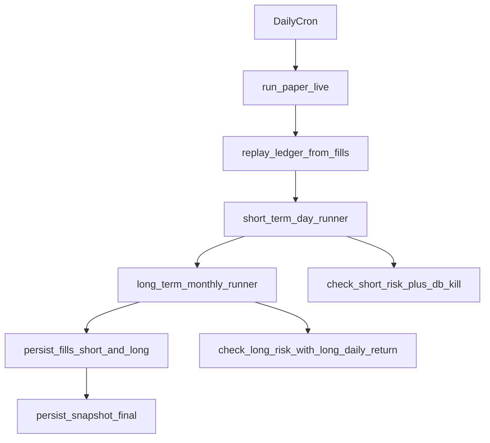

# Plan por fases chicas: largo + guardrails

## Objetivo
Cerrar tres brechas operativas: (1) ejecutar el motor largo dentro del loop diario paper-live, (2) hacer efectivo el límite diario de riesgo largo, y (3) unificar la lógica de riesgo corto para no mantener dos cadenas duplicadas.

## Estrategia de ramas (regla operativa)
- Mantener dos ritmos separados:
  - `main`: rama limpia de ingeniería (código, PRs, CI, revisión, historial legible).
  - `paper-live-data`: rama de operación diaria (mismo código + estado operativo, incluyendo `data/market.db` vía LFS).
- Regla práctica:
  - Código nuevo nace y se revisa en `main`.
  - Operación diaria vive en `paper-live-data`.
  - Cadencia fija de sincronización: `git checkout paper-live-data && git merge main`.
- Beneficio buscado:
  - Evitar que estado runtime/binarios ensucien `main` (diffs ruidosos, historial inflado, reviews y bisect más difíciles).
- Trade-off explícito:
  - Requiere disciplina de merge para evitar drift entre ramas.

## Fase 0 — Baseline y red de seguridad (solo tests y lectura)
- Validar baseline actual con tests focalizados en:
  - `[tests/test_run_paper_live.py](c:/Users/Dell/Agus/Bot de Trading/tests/test_run_paper_live.py)`
  - `[tests/test_risk_guardrails.py](c:/Users/Dell/Agus/Bot de Trading/tests/test_risk_guardrails.py)`
  - `[tests/test_short_term_day_runner.py](c:/Users/Dell/Agus/Bot de Trading/tests/test_short_term_day_runner.py)`
- Agregar (primero en rojo) 2 tests de comportamiento:
  - `check_long_risk` debe bloquear cuando el retorno diario largo cae bajo umbral real (no default implícito).
  - `_check_risk_with_optional_db` debe mantener el mismo orden de decisiones que `check_short_risk` + semántica de kill switch persistido.

## Fase 1 — Arreglar contrato de riesgo largo (no-op -> efectivo)
- Modelar explícitamente el insumo que `check_long_risk` necesita:
  - Opción recomendada: exponer `long_daily_return` desde ledger al momento de `mark_to_market`.
- Implementación mínima y consistente:
  - Extender `[core_sim/ledger.py](c:/Users/Dell/Agus/Bot de Trading/core_sim/ledger.py)` para calcular retorno diario largo con la misma idea usada en `short_bucket.daily_return` (comparación contra MTM del día hábil anterior).
  - Pasar a `check_long_risk` un scoreboard largo explícito desde `[core_sim/long_term_monthly_runner.py](c:/Users/Dell/Agus/Bot de Trading/core_sim/long_term_monthly_runner.py)` (evitar depender de `snap` genérico).
- Tests:
  - Cubrir caso “insumo faltante” y caso “breach real” en `[tests/test_risk_guardrails.py](c:/Users/Dell/Agus/Bot de Trading/tests/test_risk_guardrails.py)` y/o `[tests/test_long_term_monthly_runner.py](c:/Users/Dell/Agus/Bot de Trading/tests/test_long_term_monthly_runner.py)`.

## Fase 2A — Integración técnica sin ejecución (cableado seguro)
- Cablear segundo ciclo de backtester en `[scripts/run_paper_live.py](c:/Users/Dell/Agus/Bot de Trading/scripts/run_paper_live.py)` sin ejecutarlo por default:
  - Instanciar `create_long_term_monthly_backtester`.
  - Construir `pipeline_context` largo con `us_sessions`, `positions_qty_long`, `long_bucket_mtm`, `long_cash`.
  - Incorporar feature flag `enable_long_engine=false` por default para evitar cambios de comportamiento hasta validar.
- Mantener consistencia de capital/buckets:
  - Derivar `long_cash` y MTM desde snapshot/ledger para respetar split 30/70.
- Pruebas de no-regresión:
  - Extender `[tests/test_run_paper_live.py](c:/Users/Dell/Agus/Bot de Trading/tests/test_run_paper_live.py)` para verificar que con flag apagado el flujo corto queda idéntico.

## Fase 2B — Activación de ejecución real del largo
- Activar ejecución del motor largo detrás del feature flag en `run_paper_live.py`.
- Persistencia:
  - Persistir fills del largo en la misma corrida diaria.
  - Persistir snapshot final del día después de ejecutar ambos sleeves.
- Pruebas de regresión funcional:
  - Verificar aparición de fills `bucket=long` cuando corresponde.
  - Verificar que snapshot final refleja actividad del sleeve largo.

## Fase 3 — Eliminar duplicación de riesgo en runner corto
- Refactor de `[core_sim/short_term_day_runner.py](c:/Users/Dell/Agus/Bot de Trading/core_sim/short_term_day_runner.py)`:
  - Convertir `_check_risk_with_optional_db` en orquestador liviano:
    - Reutiliza `check_short_risk` para data-quality, no-trade y daily-loss.
    - Conserva `check_and_persist_kill_switch` como capa específica cuando hay DB.
- Objetivo: una sola fuente de verdad para la cadena de 4 pasos, con extensión DB explícita y testeada.
- Pruebas:
  - Añadir tests de no-regresión para demostrar equivalencia de decisiones entre camino con DB y sin DB (excepto metadata/persistencia esperada del kill switch).

## Fase 4 — Hardening y cierre
- Ajustar documentación operativa:
  - `[docs/project-overview.md](c:/Users/Dell/Agus/Bot de Trading/docs/project-overview.md)`
  - `[decisiones-tecnicas.md](c:/Users/Dell/Agus/Bot de Trading/decisiones-tecnicas.md)` (si se formaliza la decisión de orden de ejecución short->long en paper-live).
- Ejecutar suite objetivo + lints de archivos tocados.
- Agregar observabilidad explícita para operación diaria:
  - Métricas mínimas por día: `fills_long_count`, `long_risk_block_count`, `snapshot_long_equity_present`.
  - Alerta si hay N días hábiles seguidos sin señales de actividad/estado esperado del largo (definir N en policy).
- Definir rollback operativo a short-only:
  - Mantener desactivación inmediata mediante `enable_long_engine=false` sin cambios de código.
  - Documentar procedimiento de rollback en runbook operativo.
- Definir checklist de salida:
  - paper-live corre ambos sleeves cuando el flag está activo,
  - con flag apagado no hay regresión del flujo corto,
  - guardrail largo dispara en breach real,
  - no hay lógica de riesgo corto duplicada,
  - existe observabilidad mínima y rollback short-only probado,
  - sincronización `main -> paper-live-data` documentada y ejecutada con cadencia fija.

## Fase 5 — Operación continua entre ramas (anti-drift)
- Formalizar workflow de ramas en runbook:
  - Qué tipo de cambio entra en `main` vs `paper-live-data`.
  - Cuándo y cómo sincronizar `main -> paper-live-data`.
  - Qué hacer ante conflictos frecuentes (prioridad de resolución por tipo de archivo).
- Definir checklist semanal de salud de ramas:
  - última fecha de merge `main -> paper-live-data`,
  - estado de LFS en `paper-live-data`,
  - verificación de que `main` no contiene artefactos operativos (`data/market.db` y similares).
- Incluir criterio de rollback por ramas:
  - rollback funcional en `paper-live-data` sin ensuciar `main`,
  - hotfix de código se hace en `main` y luego se propaga por merge.

## Orden recomendado de entrega
1. Fase 1 (riesgo largo efectivo).
2. Fase 2A (cableado sin ejecución real).
3. Fase 2B (activación y persistencia real del largo).
4. Fase 3 (deduplicación riesgo corto).
5. Fase 4 (hardening/documentación/observabilidad/rollback).
6. Fase 5 (operación continua y sincronización de ramas).

## Mapa de flujo objetivo

## Riesgos a vigilar
- Orden de ejecución short->long puede afectar caja disponible intradía; mantenerlo fijo y documentado.
- Índices frágiles de eventos en `run_paper_live.py` (hoy asume posiciones fijas) deben reemplazarse por extracción robusta por tipo de evento.
- No introducir columnas/contratos de persistencia sin test de migración o backward compatibility.