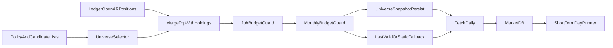

# Plan V2: Universo AR + CEDEAR con IOL

## Objetivo y alcance
- Incorporar un universo operativo de **10 Merval + 20 CEDEAR** basado en liquidez, respetando **25.000 llamadas/mes**.
- Mantener arquitectura **paper-first**: no incluye ejecución real.
- Garantizar una sola fuente de verdad para símbolos entre ingesta, estrategia y validación.

## Regla de holdings (sticky para datos)
- **Si hay posición abierta en un ticker AR (paper o futuro live), hay que seguir trayendo su OHLCV** aunque ese símbolo **deje de entrar** en el top por volumen del rebalanceo semanal.
- La lista efectiva de **ingesta** no es solo el top dinámico: es **`unión(top_Merval ∪ top_CEDEAR ∪ símbolos con qty ≠ 0 en ledger/cuenta AR)`** (definir lectura desde `MarketDB`/ledger según modo de corrida).
- El snapshot `universe_snapshots` puede seguir registrando solo el ranking liquidez; los símbolos añadidos por holding se marcan con `source=holding_overlay` (o columna equivalente) para auditoría.
- Implicancia de presupuesto API: el fetch diario puede crecer levemente mientras haya holdings fuera del top; sigue acotado por número de posiciones reales.

## Supuestos de V2 (explícitos)
- Modelo **híbrido**: candidatos base en config + selección dinámica por volumen en IOL.
- Rebalanceo de universo **semanal** (viernes post-cierre o primer día hábil siguiente).
- En fallo de selección dinámica: usar **última selección válida**; si no existe, fallback a whitelist estática.

## 1) Contrato de configuración y reglas de ranking (sin ambigüedad)
- Extender [config/policy.v1.yaml](config/policy.v1.yaml) con:
  - `symbols.universe_selection.enabled`
  - `symbols.universe_selection.rebalance_frequency` (`weekly`)
  - `symbols.universe_selection.targets.merval_top_n` (`10`)
  - `symbols.universe_selection.targets.cedears_top_n` (`20`)
  - `symbols.universe_selection.volume_window_trading_days` (`20`)
  - `symbols.universe_selection.tiebreakers` (`avg_notional_desc`, `symbol_asc`)
  - `symbols.universe_selection.api_budget.monthly_limit` (`25000`)
  - `symbols.universe_selection.api_budget.soft_limit_pct` (`0.8`)
  - `symbols.universe_selection.api_budget.max_calls_per_job` (límite duro por corrida)
- Actualizar [config/policy.v1.schema.json](config/policy.v1.schema.json) y tests de contrato.
- Separar candidatos en archivos dedicados:
  - [config/symbols/whitelist_ar.yaml](config/symbols/whitelist_ar.yaml) (Merval candidatos)
  - nuevo archivo CEDEAR candidatos (p. ej. `config/symbols/whitelist_cedear.yaml`)

## 2) Selector de universo con persistencia auditable
- Crear `data/universe_selector.py` con responsabilidades:
  - leer candidatos,
  - consultar volumen IOL para ventana fija,
  - construir top 10/20 con fórmula determinística,
  - exponer una función de **universo de fetch** que haga `merge(top_selection, open_holdings_ar)` sin duplicados,
  - devolver metadata de selección (fecha, ventana, fuente, razones de exclusión).
- Reusar autenticación y cache de tokens de [data/connectors/ar_connector.py](data/connectors/ar_connector.py).
- Persistir el **universo efectivo por fecha** en DB (tabla nueva propuesta `universe_snapshots`):
  - `selection_date`, `bucket` (`merval`/`cedear`), `symbol`, `rank`, `metric_value`,
  - `source` (`dynamic`/`fallback_last_valid`/`fallback_static`), `policy_version`.

## 3) Integración única en pipeline (fetch + estrategia)
- Integrar selector en [scripts/fetch_daily.py](scripts/fetch_daily.py):
  - resolver universo al inicio de la corrida,
  - **sumar símbolos AR con posición abierta** antes de llamar a [data/fetcher.py](data/fetcher.py) (para riesgo, MTM, salidas, stops).
- Consumir la misma resolución de símbolos en [core_sim/short_term_day_runner.py](core_sim/short_term_day_runner.py) para evitar drift entre “lo que descargo” y “lo que opero”.
  - Distinguir si hace falta: universo **candidatos señal** (top liquidez) vs universo **barras requeridas** (top ∪ holdings); el motor corto puede seguir rankeando solo candidatos, pero debe tener historial de todo lo holdings.
- Mantener backward compatibility: si `universe_selection.enabled=false`, flujo actual de whitelist sigue intacto.

## 4) Presupuesto API en dos niveles (mensual + por job)
- Agregar metering de llamadas IOL por tipo:
  - `token`, `refresh`, `history`, `universe_volume`.
- Definir guardrails:
  - **Por job** (`max_calls_per_job`): si se supera, cortar selección dinámica de esa corrida y fallback.
  - **Mensual soft** (80%): warning + degradar rebalanceo a mensual.
  - **Mensual hard** (100%): desactivar dinámica y operar estático hasta reinicio de período.
- Exponer métricas en logs estructurados y en salida JSON de [scripts/fetch_daily.py](scripts/fetch_daily.py).

## 5) Testing de comportamiento (smart-testing)
- Nuevo `tests/test_universe_selector.py`:
  - ranking por volumen correcto,
  - desempate determinístico,
  - faltantes de datos,
  - **unión top + holdings** cuando un símbolo cae fuera del top pero sigue en cartera,
  - fallback a última selección válida,
  - corte por límite por job y por límite mensual.
- Extender [tests/test_data_ar_connector.py](tests/test_data_ar_connector.py) para metering por tipo de llamada.
- Ajustar integración en [tests/test_data_fetcher.py](tests/test_data_fetcher.py) y [tests/test_short_term_day_runner.py](tests/test_short_term_day_runner.py) para validar fuente única de universo.

## 6) Documentación y ADR
- Actualizar [README.md](README.md) y [docs/project-overview.md](docs/project-overview.md) con:
  - lógica de universo híbrido,
  - **ingesta siempre incluye posiciones AR abiertas aunque salgan del top por volumen**,
  - rebalanceo semanal,
  - política de presupuesto mensual y por job.
- Registrar ADR en [decisiones-tecnicas.md](decisiones-tecnicas.md):
  - fórmula de ranking,
  - política de fallback,
  - **overlay de holdings en lista de fetch OHLCV**,
  - metering/guardrails de API.

## Flujo V2

## Presupuesto esperado (orden de magnitud)
- Fetch diario de 30 símbolos: ~`30 * 22 = 660` llamadas/mes (base).
- Selección semanal sobre candidatos acotados: baja/mediana, controlada por `max_calls_per_job`.
- Auth con cache/refresh: bajo.
- Objetivo operativo V2: **< 10.000 llamadas/mes** para conservar colchón de retries/incidentes.
