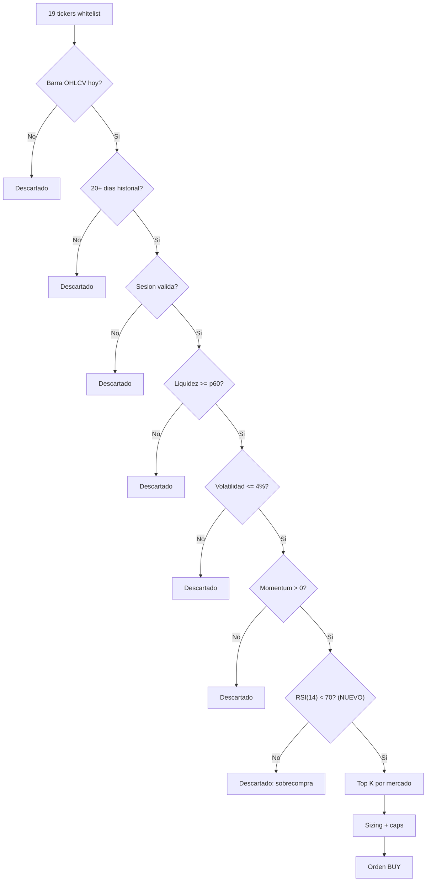

# Mejorar estrategia corto plazo con indicadores tecnicos

## Diagnostico actual

El motor corto (`short_term_engine.py`) hoy decide asi:

- **Entrada**: momentum puro de 20 dias (`close / close_20d_ago - 1 > 0`) + filtros de liquidez/volatilidad + ranking top-K
- **Salida**: solo por stop loss ATR (reactivo, espera a que el precio caiga hasta `entry - 2*ATR`) o kill switch

Problemas que esto causa:
1. **Entradas falsas**: compra tickers con momentum positivo incluso cuando estan sobrecomprados (el precio subio demasiado rapido y probablemente va a corregir)
2. **Salidas tardias**: no hay senial de "el momentum se agoto, vende antes del stop loss". Solo sale cuando ya perdio bastante.

## Indicador propuesto: RSI(14)

Un solo indicador que resuelve ambos problemas. RSI (Relative Strength Index) mide la velocidad y magnitud de cambios de precio recientes en una escala de 0 a 100.

### Por que RSI y no otro

- **Es complementario al momentum**: el momentum dice "esta subiendo", RSI dice "se paso de rosca subiendo" o "ya paro de subir". No son redundantes.
- **Un solo parametro nuevo por lado** (umbral de sobrecompra para entrada, umbral de agotamiento para salida). Minimiza riesgo de overfitting.
- **Robusto**: funciona en cualquier timeframe, ampliamente estudiado, sin curvas exoticas.
- **Deterministico y auditable**: formula cerrada, sin ventanas adaptativas ni ML.

Alternativas descartadas:
- **MACD**: 3 parametros nuevos (fast, slow, signal) -- mas complejidad de la pedida
- **Bollinger Bands**: resuelve solo entradas, no salidas
- **Medias moviles cruzadas**: requiere 2 lookbacks mas, y en ventanas de 12 dias OOS da seniales lentas

## Diseno concreto

### Entrada: filtro anti-sobrecompra

Agregar un paso nuevo al embudo en `compute_signal_candidates()`:

```
Si RSI(14) > rsi_overbought_threshold (default 70) -> descartar con reason "rsi_overbought"
```

Esto evita comprar tickers que ya subieron mucho y estan por corregir. El momentum puede ser positivo, pero si RSI > 70, la probabilidad de reversion es alta.

### Salida: crossover descendente de RSI (Mejora 1)

En vez de usar un umbral fijo ("RSI < 45 -> vende"), usar un **crossover descendente**: vender cuando RSI cruza hacia abajo el umbral desde arriba. Esto evita salidas falsas cuando RSI simplemente esta bajo y estable (ej: pullback sano en tendencia alcista).

Agregar una verificacion en el pipeline de `propose_orders`:

```
Para cada posicion abierta del bucket short:
  rsi_yesterday = RSI(14) del dia anterior (guardado en pipeline_context o snapshot)
  rsi_today = RSI(14) de hoy
  Si rsi_yesterday >= rsi_exit_threshold AND rsi_today < rsi_exit_threshold:
    -> generar orden SELL con reason "rsi_momentum_exhausted"
```

Esto requiere propagar `rsi_prev` por simbolo entre dias dentro de la ventana OOS. En `_simulate_oos_window`, se mantiene un dict `rsi_by_symbol_prev: dict[str, float]` que se actualiza al final de cada dia.

### Diagrama del embudo actualizado



### Contadores de decisiones RSI en el reporte (Mejora 2)

Cada ventana OOS reporta contadores que explican POR QUE cambio el resultado:

- `entries_blocked_by_rsi`: compras frenadas por sobrecompra (RSI > 70)
- `exits_by_rsi`: ventas disparadas por crossover descendente de RSI
- `exits_by_stop_loss`: ventas disparadas por stop loss ATR (ya existe, pero sin contador explicito)

Se agregan como campos nuevos en el dict retornado por `_simulate_oos_window()` y se propagan a `_window_row()` en el script runner, apareciendo en el CSV y JSON de salida.

Esto permite auditar decisiones como: "en la ventana de marzo, RSI bloqueo 4 entradas y disparo 2 salidas anticipadas, el drawdown bajo de -5% a -1%".

### Parametros nuevos en policy.v1.yaml

Bajo `short_term_engine`:

```yaml
short_term_engine:
  # ... existentes ...
  rsi_lookback: 14
  rsi_overbought_entry: 70     # no comprar si RSI > este valor
  rsi_exit_threshold: 45       # vender posicion si RSI cae debajo
```

Son 3 valores, pero `rsi_lookback: 14` es un standard de la industria que no deberia tocarse. Los unicos tunables reales son los dos umbrales.

## Archivos a modificar

1. **`core_sim/short_term_engine.py`**:
   - Agregar `compute_rsi()` (funcion pura, ~15 lineas)
   - Agregar campo `rsi_lookback` y `rsi_overbought_entry` a `ShortEngineConfig`
   - Agregar filtro RSI en `compute_signal_candidates()` (3 lineas)

2. **`core_sim/short_term_day_runner.py`**:
   - En `build_market_snapshot_rows()`: calcular RSI a partir de `closes_hist` y agregarlo como campo `rsi_14` en la fila
   - En la logica de `propose_orders`: verificar crossover descendente de RSI (ayer >= umbral, hoy < umbral) para posiciones abiertas y generar SELLs
   - Propagar `rsi_by_symbol` en `pipeline_context` para que el dia siguiente tenga `rsi_prev`

3. **`config/policy.v1.yaml`**:
   - Agregar los 3 parametros nuevos bajo `short_term_engine`

4. **`config/policy.v1.schema.json`**:
   - Validar los 3 campos nuevos

5. **`core_sim/short_term_pre_gate.py`** + **`scripts/run_short_term_pre_gate.py`**:
   - En `_simulate_oos_window()`: mantener `rsi_by_symbol_prev` entre dias, contar `entries_blocked_by_rsi`, `exits_by_rsi`, `exits_by_stop_loss` y agregarlos al dict de metricas
   - En `_window_row()`: propagar los 3 contadores al CSV/JSON

6. **Tests**:
   - Test unitario de `compute_rsi()` con serie conocida
   - Test de que `compute_signal_candidates` descarta con `rsi_overbought`
   - Test de crossover descendente: no vende si RSI esta bajo pero estable, si vende si cruza hacia abajo
   - Test de que los contadores se incrementan correctamente

## Riesgos y trade-offs

- **RSI no es magico**: en tendencias fuertes, RSI puede estar en sobrecompra durante semanas (el ticker sigue subiendo). El umbral 70 puede filtrar entradas buenas. Mitigation: se puede probar con 75 si 70 resulta muy agresivo.
- **Salida por crossover RSI puede ser prematura**: el ticker puede rebotar. Mitigado por usar crossover en vez de umbral fijo (no vende si RSI ya estaba bajo).
- **Mas historial necesario**: RSI(14) necesita al menos 15 cierres. Hoy ya se piden 20 para momentum, asi que no agrega restriccion.

## Validacion

Despues de implementar, correr el mismo walk-forward 180d y comparar:
```bash
python scripts/run_short_term_pre_gate.py --db data/market.db --lookback-trading-days 180 --out-json outputs/pre_gate_windows_180d_rsi.json --out-csv outputs/pre_gate_windows_180d_rsi.csv
```

Comparar contra baseline existente (`outputs/pre_gate_windows_180d.json`, 4/13 passed):
- `windows_passed`: deberia subir
- `avg max_drawdown_pct`: deberia achicarse
- `entries_blocked_by_rsi`: cuantas entradas evito
- `exits_by_rsi` vs `exits_by_stop_loss`: proporcion de salidas inteligentes vs reactivas
