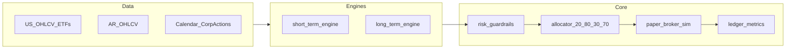

# Bot de Trading (Paper-First)

Bot de trading/inversión en Python con foco en perfil moderado, arquitectura desacoplada y riesgo determinístico en código.

## Objetivo del proyecto

- Priorizar `paper trading` con datos reales antes de cualquier integración live.
- Separar motores por horizonte:
  - `short_term_engine` (diario, 30% objetivo)
  - `long_term_engine` (mensual, 70% objetivo)
- Centralizar controles críticos en un núcleo común: `risk_guardrails`, `allocator`, `paper_broker_sim`, `ledger`.
- Mantener trazabilidad y auditabilidad de decisiones de riesgo y ejecución.

## Estado actual (abril 2026)

### Implementado

- Política de riesgo y operativa:
  - `POLICY.md`
  - `config/policy.v1.yaml`
  - `config/policy.v1.schema.json`
  - tests de contrato en `tests/test_policy_schema.py`
- Core de simulación (`core_sim/`):
  - `DailyEventBacktester` con pipeline fijo
  - `CostModel` configurable por mercado
  - `PortfolioLedger` con PnL y drawdown mensual del bucket corto
  - `PaperBrokerSim` con interfaz estable y fills determinísticos
  - Stores de calendario y corporate actions (v1)
- `short_term_engine` v1 (Fase B):
  - módulo `core_sim/short_term_engine.py`
  - helpers puros para score/filtros/ranking/sizing
  - generación de `orders_intent` con `skip_reasons` y métricas
  - tests unitarios en `tests/test_short_term_engine.py`
- Pipeline corto integrado (Fase C, v1):
  - `core_sim/short_term_day_runner.py` — Data (snapshot + whitelist) → Engines → Risk → órdenes listas para `PaperBrokerSim`
  - **Riesgo en el mismo runner**: kill switch por DD mensual del bucket corto; límite de **pérdida diaria** del corto (`risk.max_daily_loss_short_pct` + `short_bucket.daily_return` en `PortfolioLedger`); **ventanas no-trade** intradía US (`no_trade_*_minutes` + `session_minutes_from_open` opcional en `pipeline_context`); **`halt_on_data_quality`** con señal `risk_flags` (universo parcial en `daily_bars` permitido; fallan barras vacías o campos inválidos en símbolos presentes).
  - **Allocator 30/70 + 20/80** en el sizing de `build_orders_intent`: tope de tranche corto vs equity total y headroom AR/US por mercado sobre el total, antes de lotes y cash.
  - `create_short_term_daily_backtester(...)` arma un `DailyEventBacktester` cableado al broker y al ledger
  - `DailyEventBacktester.run_day(..., pipeline_context={"history_by_symbol": ...})` admite también `session_minutes_from_open` cuando se quiera simular no-trade intradía
  - tests de integración en `tests/test_short_term_day_runner.py` (E2E, kill switch, no-trade, calidad de datos, pérdida diaria)
- **Pruebas y CI** (criterio *smart-testing*): suite en `tests/` con foco en comportamiento; `pytest-cov` en `requirements.txt`; GitHub Actions ejecuta `pytest` con cobertura mínima sobre `core_sim`.
- **Pre-gate walk-forward (Fase 3)**: `core_sim/short_term_pre_gate.py` + `short_term_pre_gate` en `config/policy.v1.yaml`; script `scripts/run_short_term_pre_gate.py` (demo sintética); tests en `tests/test_short_term_pre_gate.py`.

### Pendiente principal

- Matriz de riesgo extendida al **motor largo** (pérdidas diarias/mensuales long/total, etc.) y módulo dedicado `risk_guardrails` si se extrae del runner.
- Integración completa del `long_term_engine`.
- Informe KPI agregado (Sharpe, Sortino, Calmar, alpha vs benchmark, etc.) y gate de ramp más allá del pre-gate mínimo del corto.

## Arquitectura resumida



## Contratos y documentación clave

- Plan maestro: `.cursor/plans/bot_trading_paper-first_155d6f04.plan.md`
- Política operativa: `POLICY.md`
- Decisiones técnicas (ADR): `decisiones-tecnicas.md`
- Config parseable v1: `config/policy.v1.yaml`
- Schema de validación: `config/policy.v1.schema.json`

## Ejecutar validaciones

```bash
pip install -r requirements.txt
python -m pytest tests/ -v
python -m pytest tests/ -v --cov=core_sim --cov-report=term-missing
python scripts/run_short_term_pre_gate.py
```

Por módulo (desarrollo acotado):

```bash
python -m pytest tests/test_policy_schema.py -v
python -m pytest tests/test_short_term_engine.py -v
python -m pytest tests/test_short_term_day_runner.py -v
python -m pytest tests/test_event_engine.py -v
```

## Principios no negociables

- Sin secretos en repo (`.env` o gestor de secretos).
- Paper-first por defecto.
- Riesgo en código determinístico, no en prompts.
- Cambios acotados y auditables.
