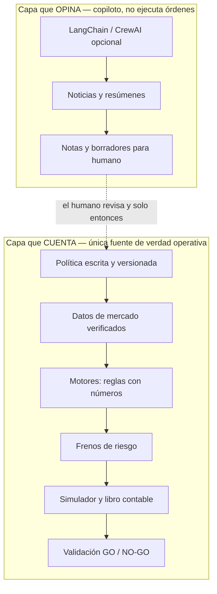

# Anexo — LangChain, CrewAI y capas de confianza

Complemento de `docs/project-overview.md` (sección 12). Aclara por qué el proyecto **no** usa frameworks de agentes LLM en el path de ejecución, y cómo podrían complementar el sistema más adelante sin romper la filosofía paper-first.

## Qué son (breve)

- **LangChain** ([documentación](https://docs.langchain.com/oss/python/langchain/overview)): framework open source para conectar modelos de lenguaje con datos externos, herramientas (tools) y flujos de agente. Estandariza integraciones y orquesta pasos donde el LLM decide qué herramienta usar (patrón tipo ReAct).
- **CrewAI** ([introducción](https://docs.crewai.com/en/introduction)): framework orientado a **equipos de agentes** con rol, objetivo y colaboración. Combina **Flows** (orquestación y estado) con **Crews** (grupos de agentes que resuelven tareas delegadas).

Ambos son útiles cuando el problema es **lenguaje natural, ambigüedad o investigación abierta**. No reemplazan reglas de trading versionadas y testeables.

## Ventajas que podrían aportar (fuera del núcleo)

| Ventaja | Ejemplo de uso compatible con este repo |
|---------|----------------------------------------|
| Velocidad en tareas textuales | Resumir filings, notas o logs de paper-live para revisión humana |
| Multi-agente para research | Un crew "analista + revisor" que contrasta un borrador de `POLICY.md` o un diff de policy |
| Integración con muchas APIs | Prototipos de copiloto que leen fuentes heterogéneas sin cablear cada conector a mano |
| Exploración de hipótesis | Brainstorm de indicadores o escenarios en notebook, **sin** tocar `run_paper_live.py` |

## Por qué no se usan en ejecución ni en riesgo

La decisión formal está en **ADR-002** (`decisiones-tecnicas.md`): los límites de riesgo (kill switch, pérdida diaria, ventanas sin operar, etc.) están escritos como **reglas fijas en código**, no como instrucciones a un modelo de lenguaje.

| | **Capa que "opina"** (LLM / LangChain / CrewAI) | **Capa que "cuenta"** (reglas del bot) |
|---|---|---|
| Pregunta que responde | "¿Qué significa este titular o este texto?" | "Con estos números de hoy, ¿opero o no?" |
| Misma situación mañana | Puede cambiar la redacción o el énfasis | Debe dar la **misma** respuesta |
| Si se equivoca | Perdés tiempo revisando un resumen | Podrías operar cuando no debías, o no frenar a tiempo |

**Tres motivos, en lenguaje llano:**

1. **Reproducibilidad** — Mismos datos + misma política = misma decisión. Un LLM es probabilístico.
2. **Auditoría** — Si algo sale mal, hay que explicar *qué regla* actuó, no "la IA lo interpretó así".
3. **Riesgo de interpretación** — Los modelos son fuertes con texto ambiguo y débiles sin red de seguridad numérica.

Un cuarto motivo práctico: **costo y tiempo** — un equipo de agentes hace muchas llamadas al modelo por día; el pipeline paper-live debe ser rápido y estable.

**Aclaración:** los "roles" de `AGENTS.md` (Spec, Risk, Engines) organizan **cómo trabajamos en el repo** (humanos y asistente del IDE). No son agentes CrewAI corriendo cada mañana en producción.

## Qué capa confiás a la probabilidad y cuál a la matemática fija

**Regla de oro:** *el LLM propone ideas y texto; las reglas escritas y el código deciden el dinero* (aunque sea simulado en paper).

### Capa probabilística — confiás en la interpretación, no en la ejecución

- Leer y resumir noticias, informes o logs largos.
- Proponer etiquetas ("macro", "resultados trimestrales", "riesgo regulatorio").
- Ayudar a redactar o revisar la política del proyecto.
- Explorar hipótesis en chat o notebook.

**Nada de esto mueve una orden** hasta que una persona lo traduce a reglas versionadas y testeadas.

### Capa matemática fija — confiás en números y reglas

- Política y límites versionados (`POLICY.md`, `config/policy.v1.yaml`).
- Calidad de los datos de mercado.
- Señales del motor corto y largo.
- Frenos de riesgo centralizados (`risk_guardrails.py`).
- Simulación y contabilidad (`PaperBrokerSim`, `PortfolioLedger`).
- Validación global GO / NO-GO.

## Mejora futura posible (investigación, sin señal directa)

Escenario acotado, alineado a ADR-002:

1. **Ingesta diaria** de titulares o notas, fuera del horario crítico de `run_paper_live`.
2. **Crew o agente LangChain** que resume eventos y propone etiquetas (`earnings`, `regulatorio`, `macro`, etc.).
3. **Validación humana obligatoria** antes de persistir: nada entra a motores ni a `policy.v1.yaml` sin revisión y, si aplica, ADR + evidencia walk-forward.
4. **Salida permitida**: entradas en `knowledge-base/`, issues de seguimiento o borradores de policy — **no** scores que muevan ranking RSI/momentum ni órdenes en el broker simulado.

Si algún día se quisiera que etiquetas influyan en señales, sería un **cambio de contrato** del motor, con pre-gate OOS y ADR dedicado; hoy queda fuera de alcance.
