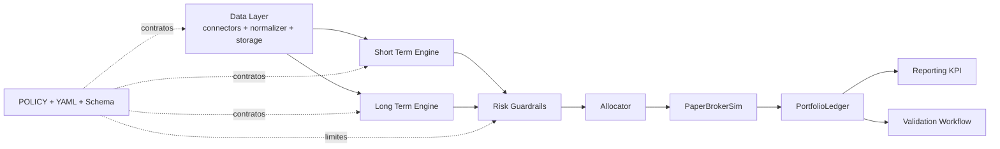
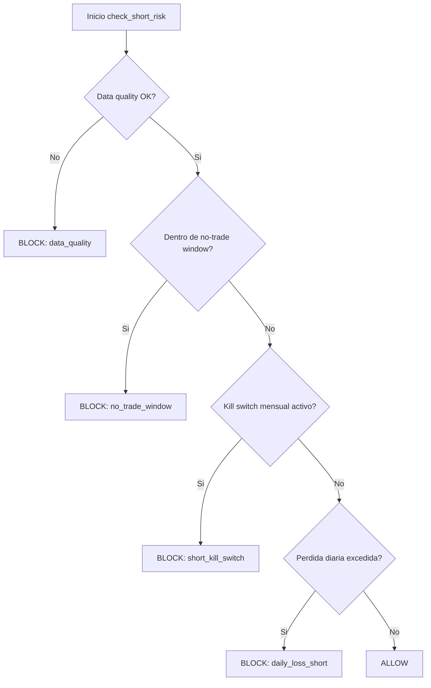
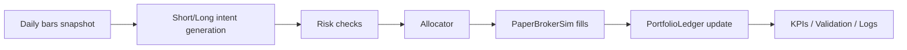

# Project Overview — Bot de Trading (paper-first)

Este documento esta pensado para dos usos:

- Servir como guion tecnico para una defensa oral.
- Permitir lectura simple para alguien que entra por primera vez al repo.

No busca reemplazar la documentacion normativa (`POLICY.md`) ni el registro de decisiones (`decisiones-tecnicas.md`), sino unir arquitectura, criterio y estado actual.

## 1) El problema y la filosofia

El problema que resuelve el proyecto es evitar decisiones de inversion manuales impulsivas y no reproducibles. El foco esta en construir un proceso estable, medible y auditable.

La filosofia base es:

- **Paper-first**: primero validar en simulacion con datos reales.
- **Riesgo deterministico en codigo**: los guardrails no dependen de prompts ni heuristicas opacas.
- **Proceso antes que rentabilidad**: subir exposicion solo despues de pasar gates definidos.
- **Trazabilidad completa**: cada regla relevante queda versionada en YAML, validada por schema y explicada en politica.

## 2) Arquitectura general

La arquitectura separa responsabilidades: data, engines, riesgo, ejecucion simulada, contabilidad y reporting. Esto permite evolucionar un bloque sin romper el resto.

### Decisiones clave de arquitectura

- Se separan **engines por horizonte** (`short_term_engine` diario y `long_term_engine` mensual) para no mezclar logicas con distintos tiempos de decision.
- El modulo `risk_guardrails` concentra reglas de bloqueo para tener un unico punto auditable.
- `event_engine` coordina el pipeline diario y evita que cada modulo defina su propio "orden de pasos".
- `paper_broker_sim` y `ledger` modelan ejecucion y PnL de forma estable antes de hablar de capital real.

## 3) Gestion de riesgo

El riesgo se implementa como reglas operativas explicitas, no como recomendaciones "blandas". El objetivo es que ante la misma entrada, la decision sea siempre la misma.

### Guardrails del bloque corto

`check_short_risk()` evalua en orden de severidad:

1. Calidad de datos.
2. Ventana no-trade intradia.
3. Kill switch mensual del bucket corto.
4. Limite de perdida diaria del bucket corto.

Si una regla bloquea, no se ejecutan entradas nuevas. La salida de cada evaluacion queda en logs estructurados para auditoria.

### Guardrails del bloque largo

`check_long_risk()` aplica un limite diario del sleeve largo y evita rebalanceos cuando el contexto excede el riesgo permitido.

### Stop loss por instrumento

`check_stop_loss()` usa ATR(14) cuando hay historia suficiente y fallback porcentual cuando no la hay. Un stop loss es una salida de riesgo y tiene prioridad operativa frente a bloqueos de nuevas entradas.

## 4) Motor de corto plazo

El corto plazo esta pensado para decisiones diarias y control estricto de exposicion:

- Genera candidatos con momentum y filtros de liquidez/volatilidad.
- **Filtra sobrecompra con RSI(14)**: si `RSI > rsi_overbought_entry` (default 70), el candidato se descarta con motivo `rsi_overbought`. Esto evita entrar en tickers cuyo momentum es positivo pero cuya velocidad de suba sugiere reversion.
- Rankea por mercado y limita seleccion (`top_k_per_market`).
- Construye `orders_intent` con sizing por presupuesto de riesgo.
- Pasa por `risk_guardrails` antes de llegar al broker simulado.
- **Salida anticipada por RSI**: para posiciones abiertas del bucket corto, si RSI cruza descendentemente el umbral `rsi_exit_threshold` (default 45) — es decir, ayer >= umbral y hoy < umbral — se genera una orden SELL con motivo `rsi_momentum_exhausted`. El crossover evita salidas falsas cuando RSI simplemente esta bajo y estable.
- **Contadores de auditoria**: cada ventana OOS reporta `entries_blocked_by_rsi`, `exits_by_rsi` y `exits_by_stop_loss` para explicar por que cambio el resultado.

En terminos de defensa oral, la idea central es: el motor no "adivina", **propone**; quien habilita o bloquea finalmente es el stack de riesgo. RSI complementa al momentum (no lo reemplaza): momentum dice "sube", RSI dice "se paso de rosca".

## 5) Motor de largo plazo

El largo plazo trabaja con rebalanceo mensual por bandas de drift:

- Parte de pesos objetivo definidos en policy/config.
- Mide desvio entre peso actual y objetivo.
- Solo rebalancea si es dia valido de calendario y el drift supera el umbral.
- En v1, el satelite esta acotado y controlado por limites explicitos.

Este bloque apunta a estabilidad de cartera y menor rotacion relativa, complementando al motor corto que es mas tactico.

## 6) Datos, mercado y APIs

Esta seccion es critica porque sin calidad de datos no hay señal confiable ni riesgo valido.

### Fuentes y criterio de uso

- **US OHLCV**: `yfinance` con retry exponencial (`data/connectors/us_connector.py`).
- **AR OHLCV**: IOL REST API como primario y fallback Byma/yfinance (`data/connectors/ar_connector.py`).
- **Calendarios**: `pandas_market_calendars` para sesiones US (XNYS) y AR (XBUE) (`data/calendar_builder.py`).
- **Persistencia**: SQLite en `MarketDB` (`data/storage.py`), con tablas para OHLCV, logs, fills, snapshots y kill switch.
- **Benchmark**: `data/benchmark_returns.py` genera retornos de un benchmark mixto 20/80 (AR/US) point-in-time, sin lookahead, usando cierres disponibles hasta cada fecha de valoracion. Se usa en el informe KPI para calcular alpha vs pasivo.

### Por que esta estrategia

- Evita dependencia unica de proveedor en AR mediante fallback.
- Separa errores de red de errores de datos para diagnostico claro.
- Mantiene pipeline reproducible: fetch -> normalize -> store (`data/fetcher.py` + `data/normalizer.py`).

### Tratamiento de calidad

- Deteccion de outliers (rolling 5d median) y forward-fill acotado (≤3 dias, marcado como `imputed=True`).
- Flags de degradacion para no ocultar problemas.
- Regla operativa: sin datos confiables, no se aumenta riesgo.

## 7) Paper broker y ledger

El `PaperBrokerSim` permite validar ejecucion sin riesgo de capital real:

- Simula fills deterministas.
- Aplica costos (comision, slippage, spread) con `CostModel`.
- Devuelve reportes de fill trazables.

El `PortfolioLedger` centraliza:

- Estado de posiciones.
- PnL realizado/no realizado.
- Curva de equity.
- Drawdown mensual del bucket corto.

## 8) Paper-live y modelo de branches

### Orquestador diario

`scripts/run_paper_live.py` ejecuta el pipeline corto dia a dia contra OHLCV real en SQLite:

- Detecta el ultimo dia procesado y hace catch-up idempotente de los dias faltantes.
- Aplica politica F3: si el gap supera 3 dias habiles, exit(2) y requiere intervencion manual.
- Persiste fills y snapshots en `data/market.db` bajo mode `paper_live`.
- Replay de ledger desde fills anteriores para mantener estado coherente.

### Workflow automatizado

`.github/workflows/paper_live_daily.yml` corre de lunes a viernes a las 10:00 UTC (post-cierre US):

1. Fetch OHLCV de los ultimos 5 dias (`fetch_daily.py --lookback 5`).
2. Ejecucion del pipeline (`run_paper_live.py`).
3. Commit automatico de la DB actualizada.
4. Notificacion automatica (issue GitHub) ante cualquier fallo.

### Modelo de branches

| Rama | Proposito | Que se commitea |
|------|-----------|-----------------|
| `main` | Evolucion de codigo, PRs, CI | Solo codigo y docs |
| `paper-live-data` | Operacion diaria automatizada | Codigo + `data/market.db` (via Git LFS) |

El workflow vive en `main` (GitHub lee schedule/dispatch del default branch), pero hace checkout de `paper-live-data` para ejecutar. Git LFS para `data/*.db` evita inflar el repo con commits binarios diarios (~250/año).

## 9) Validation workflow (GO/NO-GO)

El modulo `validation/` implementa un pipeline de validacion automatica que evalua si el sistema esta en condiciones operativas. Produce un `ValidationReport` con decision binaria GO/NO-GO.

### Stages

Cada stage es independiente y retorna `StageResult` con metricas, violaciones y flag de skip:

1. **`data_quality`**: verifica integridad y frescura de datos OHLCV.
2. **`short_pre_gate`**: ejecuta walk-forward OOS del bloque corto y evalua metricas contra umbrales.
3. **`long_engine`**: valida comportamiento del motor largo (drift, rebalanceos, turnover).
4. **`risk_audit`**: audita que los guardrails actuaron correctamente en la historia reciente.
5. **`kill_switch_history`**: verifica historial de activaciones/resets del kill switch.

El runner (`validation/runner.py`) orquesta las 5 etapas y agrega la decision global. Script: `scripts/run_validation_wf.py`.

## 10) Testing y calidad

La estrategia de testing prioriza comportamiento observable:

- Reglas de riesgo y bloqueos operativos.
- Integraciones del pipeline diario.
- Contrato de policy (YAML + schema + tests).
- Regresion de KPI con fixtures golden.
- Validation stages (data quality, risk audit, kill switch history, motores corto/largo).

El repo cuenta con ~39 archivos de test, abarcando unitarios, integracion y regresion. El objetivo no es "testear por cobertura", sino reducir riesgo de regresiones en decisiones de negocio (riesgo, sizing, ejecucion y validacion).

## 11) Decisiones tecnicas clave

Las decisiones se documentan en ADRs dentro de `decisiones-tecnicas.md` (42 ADRs a la fecha). Los ejes principales son:

- Paper-first como estrategia de construccion.
- Riesgo deterministico y centralizado.
- Motores desacoplados con nucleo comun.
- Contratos versionados (`policy.v1.yaml` + schema).
- Gate KPI OOS con umbrales pre-registrados y ramp-up gradual en 5 escalones (**ADR-041**).
- RSI(14) como filtro de entrada y señal de salida del motor corto (**ADR-042**): mejoro avg max drawdown de -0.134% a -0.098% y redujo turnover de 1.69 a 1.26 en walk-forward 180d.
- Modelo de branches `main` / `paper-live-data` con LFS y notificaciones (**ADR-040**).

Para defensa oral, esta seccion muestra que la arquitectura no salio de una implementacion improvisada, sino de decisiones acumuladas y justificadas.

## 12) Metodologia con IA

La IA se uso como acelerador de implementacion y exploracion, no como reemplazo de criterio tecnico.

### Principios de uso

- Las decisiones de arquitectura, riesgo y policy se tomaron de forma explicita y versionada por el proyecto.
- La IA ayudo a iterar codigo, tests y estructura documental mas rapido.
- Cada cambio relevante se valido con contrato (schema/tests) y trazabilidad (ADR/changelog/policy).

### Controles de calidad sobre asistencia IA

- No se delega al modelo la logica de riesgo en runtime.
- Se evita acoplar comportamiento critico a prompts.
- Se exige validacion automatica y lectura critica humana antes de consolidar decisiones.

En una defensa oral, el punto central es demostrar gobernanza: **la IA fue herramienta**, el sistema de decisiones siguio siendo ingenieria controlada.

## 13) Trabajo pendiente

El proyecto esta funcional en paper-first con pipeline corto operativo diario y gate KPI OOS activo. Frentes abiertos:

1. **Acumular datos paper-live**: el gate KPI OOS requiere minimo 312 dias habiles (~15 meses); hoy hay ~120 dias historicos. El workflow diario esta activo y acumulando.
2. Completar integracion operativa plena del bloque largo en el flujo diario de paper-live (`long_term_monthly_runner` en `event_engine`).
3. Cerrar brechas entre policy y ejecucion en puntos puntuales (por ejemplo, controles de concentracion sectorial en runtime si se habilitan como bloqueantes).
4. Explorar indicadores complementarios al RSI si el drawdown mensual del bucket corto sigue siendo cuello de botella (4/13 windows passed en walk-forward 180d).
5. Extender controles CI de cobertura y regresion a modulos fuera de `core_sim` con la misma disciplina (especialmente `validation/` y `reporting/`).

Este capitulo existe para evitar una narrativa "cerrada". El sistema se presenta como una base robusta en evolucion, con backlog tecnico explicitado.

---

## Como usar este documento en defensa oral

- Abrir con secciones 1 y 2 (problema + arquitectura) para marcar contexto.
- Profundizar en 3, 4, 5 y 6 para explicar decisiones tecnicas de motores y datos.
- Usar 8 y 9 para mostrar operacion diaria real (paper-live) y validacion automatica.
- Usar 12 para explicar metodologia de construccion con IA.
- Cerrar con 13 para mostrar criterio, honestidad tecnica y roadmap.

Documentos complementarios:

- Politica operativa: `POLICY.md`
- Contrato parseable: `config/policy.v1.yaml`
- Validacion estructural: `config/policy.v1.schema.json`
- Registro de decisiones: `decisiones-tecnicas.md` (42 ADRs)
- KPI spec: `docs/kpi_report_spec.v1.md`
- Listas blancas: `config/symbols/whitelist_us.yaml`, `config/symbols/whitelist_ar.yaml`
