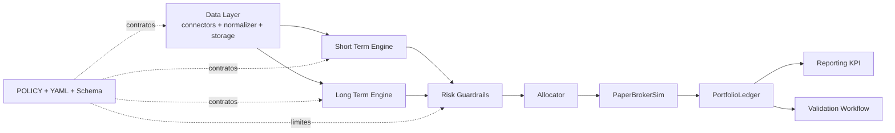
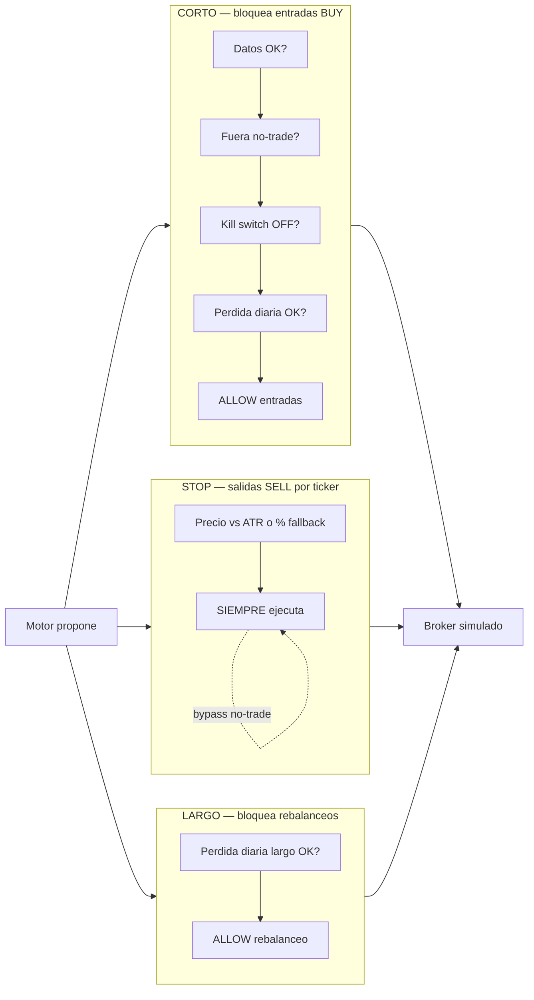
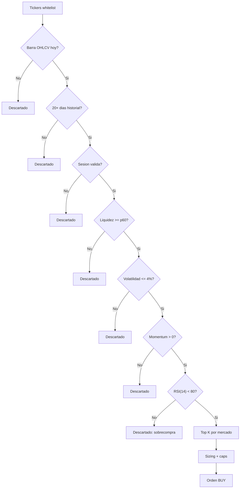
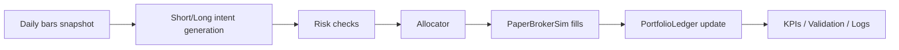

# Project Overview — Bot de Trading (paper-first)

Este documento esta pensado para dos usos:

- Servir como guion tecnico para una defensa oral.
- Permitir lectura simple para alguien que entra por primera vez al repo.

**¿Te perdés con algún término técnico?** Está todo explicado en el **Glosario (sección 0)** 

No busca reemplazar la documentacion normativa (`POLICY.md`) ni el registro de decisiones (`decisiones-tecnicas.md`), sino unir arquitectura, criterio y estado actual.

## 0) Glosario 

Este proyecto usa términos técnicos. Acá están explicados una vez, simple, para no perderse:

| Término | Qué significa, en criollo |
|---------|---------------------------|
| **Paper trading** | Operar : con datos reales del mercado pero sin plata real. |
| **Sleeve** (bucket) | Un "bolsillo" de la cartera con su propia estrategia. Acá hay dos: el **corto** (táctico, 30% del dinero) y el **largo** (estratégico, 70%). |
| **OHLCV** | Los datos de precio de cada día: Open (apertura), High (máximo), Low (mínimo), Close (cierre) y Volume (volumen operado). |
| **CEDEAR** | Un certificado que cotiza en Argentina (en pesos) y representa una acción extranjera (ej.: SPY = el índice S&P 500 de EE.UU., comprable en pesos). |
| **Venue / mercado** | Dónde cotiza un papel. `XNYS` = bolsa de Nueva York (en dólares); `XBUE` = bolsa de Buenos Aires (en pesos). |
| **Momentum** | Tendencia reciente: si un papel viene subiendo con fuerza, "tiene momentum". |
| **RSI** | Un indicador (0 a 100) que mide si un papel está "sobrecomprado" (subió demasiado rápido, puede corregir) o no. |
| **Rebalanceo / drift** | Volver la cartera a sus pesos objetivo. El **drift** es cuánto se desvió de esos pesos; si supera una banda, se rebalancea. |
| **Guardrail / kill switch** | Frenos de riesgo automáticos. El **kill switch** congela el motor si las pérdidas pasan un límite. |
| **Drawdown** | La caída desde el punto más alto. Un drawdown de -25% = perdiste 25% desde tu mejor momento. Mide el dolor máximo. |
| **Sharpe / Sortino** | Notas de "rendimiento ajustado por riesgo": cuánto ganás por unidad de riesgo. Más alto = mejor. Sortino penaliza solo las caídas. |
| **Benchmark** | Una referencia para comparar. Si rendís más que el benchmark, generaste **alpha** (valor agregado). |
| **Turnover** | Cuánto comprás y vendés. Alto turnover = mucha rotación = más costos. |
| **Walk-forward / OOS** | Forma honesta de testear: el sistema "estudia" un período y se evalúa en el siguiente que **nunca vio** (OOS = *out-of-sample*, fuera de muestra). Se repite avanzando en el tiempo. |
| **Gate** | Una barrera de aprobación. El **gate KPI OOS** son umbrales (Sharpe mínimo, drawdown máximo, etc.) que el sistema debe pasar **antes** de operar con plata real. |
| **Ramp-up** | Subir la exposición de a poco (paper → 10% → 25% → … → 100% del capital), no de golpe. |
| **TWR / MWR** | Dos formas de medir rendimiento cuando hay aportes mensuales. **TWR** mide la estrategia sin el efecto de los aportes; **MWR/TIR** mide tu experiencia real en pesos. |
| **Factor** | La fuerza macro que mueve a un activo (ej.: "riesgo-país argentino"). Dos papeles de distinto sector pueden compartir factor y caer juntos. |
| **IC** (information coefficient) | Qué tan bien la señal del bot predice el rendimiento futuro. Cerca de 0 = no predice; más alto = mejor. |

## Mapa de lectura

Este documento sirve para dos públicos. Elegí la ruta según el tiempo que tengas:

| Si tenés… | Leé | Podés obviar (por ahora) |
|-----------|-----|--------------------------|
| **15 min** (primer contacto) | §0, §1, §2, §3 (tablas de guardrails), §13 | §6B–D, anexo IA |
| **45 min** (defensa oral) | + §4, §5, **§9.1** (perfil de riesgo GGAL/PAMP), §8 (runbook) | detalle de `fetch_log`, ADRs uno a uno |
| **Onboarding dev** | + §6A, §7, §10 | notebooks de research hasta que toques validación |

**Resumen en una frase:** el motor **propone** órdenes → el riesgo **decide** si entran o no → el broker simulado **ejecuta** lo permitido → el ledger **registra** todo para auditoría.

## 1) El problema y la filosofia

El problema que resuelve el proyecto es evitar decisiones de inversion manuales e impulsivas, que no se pueden repetir ni revisar. El foco esta en construir un **proceso**: estable (da la misma respuesta ante la misma situacion), medible (todo se puede cuantificar) y auditable (siempre se puede explicar por que hizo lo que hizo).

- **Paper-first**: primero se prueba "de mentira"  con datos reales, antes de arriesgar plata.
- **Riesgo en codigo, no en opiniones**: los frenos de riesgo (guardrails) son reglas fijas escritas en el programa, no le preguntan a un LLM que decida. Misma situacion → misma decision, siempre.
- **Proceso antes que rentabilidad**: la exposicion con plata real sube solo despues de pasar barreras de aprobacion (gates) definidas de antemano.
- **Trazabilidad completa**: cada regla vive en un archivo de configuracion versionado (queda registro de cada cambio) y explicada en la politica.

## 2) Arquitectura general

El sistema esta dividido en piezas, cada una con un trabajo claro: **datos** (traer precios), **motores** (decidir que comprar/vender), **riesgo** (frenar si algo va mal), **ejecucion simulada** (simular las ordenes), **contabilidad** (llevar la cuenta) y **reportes** (medir resultados). Separarlo asi permite mejorar una pieza sin romper las demas.

### Decisiones clave de arquitectura

- Hay **dos motores separados por horizonte de tiempo**: el corto (decide todos los dias) y el largo (decide cada semana). Se separan para no mezclar logicas que operan a ritmos distintos.
- Un solo modulo de riesgo (`risk_guardrails`) concentra todos los frenos, asi hay **un unico lugar** que auditar.
- Un coordinador (`event_engine`) fija el orden de los pasos de cada dia, para que ningun modulo improvise su propia secuencia.
- El simulador de broker (`paper_broker_sim`) y la contabilidad (`ledger`) modelan las ordenes y las ganancias/perdidas (PnL = *profit and loss*) de forma estable antes de hablar de plata real.

## 3) Gestion de riesgo

El riesgo son **reglas fijas**, no recomendaciones "blandas". Ante la misma situacion, la misma decision, siempre, para poder confiar y auditar.

**Cadena operativa:** motor propone → riesgo evalua → broker ejecuta (o bloquea). Los guardrails **recomiendan**; no ejecutan solos, el runner corto/largo orquesta la decision final.

Hay **tres carriles** independientes: frenos de **entrada** (corto), frenos de **rebalanceo** (largo) y **salidas** por stop loss (por ticker). No compiten en la misma cola.

### Guardrails del bloque corto (bloquean entradas nuevas)

Se evaluan **en este orden**; la primera que falla corta el resto:

| Regla (en criollo) | Umbral (default en `POLICY.md` / `policy.v1.yaml`) | Que pasa si salta |
|--------------------|-----------------------------------------------------|-------------------|
| Datos dudosos | flags de calidad activos (`halt_on_data_quality`) | No entra en posiciones nuevas |
| Ventana no-trade | primeros y ultimos **15 min** de la sesion US (390 min totales) | No entra (ver stop loss abajo) |
| Kill switch mensual | drawdown mensual del corto **≤ −8 %** | Congela el motor corto hasta reset manual |
| Perdida diaria corto | **−2 %** del equity inicial del dia del bucket corto | Bloquea entradas del dia |

Si una regla bloquea, **no se ejecutan compras nuevas** del sleeve corto. Cada evaluacion queda en logs estructurados con motivo explicito (auditoria).

> En codigo: `check_short_risk()` en `core_sim/risk_guardrails.py`.

### Guardrails del bloque largo (bloquean rebalanceos)

| Regla (en criollo) | Umbral (default) | Que pasa si salta |
|--------------------|------------------|-------------------|
| Perdida diaria largo | **−1,5 %** del equity inicial del dia del sleeve largo | No rebalancea ese dia |
| Perdida mensual largo (policy) | **−6 %** mensual | Accion segun matriz de `POLICY.md` §5 |

El sistema compara **equity largo hoy vs ayer** (mark-to-market del dia habil anterior). Ese retorno diario lo calcula el ledger y lo usa el runner largo antes de rebalancear. **No bloquea el motor corto** — solo frena rebalanceos del largo.

> En codigo: `check_long_risk()`; insumo `long_daily_return` desde `long_bucket` del ledger (**ADR-044**).

### Stop loss por instrumento (salidas — siempre pueden ejecutarse)

| Regla (en criollo) | Umbral (default) | Que pasa si salta |
|--------------------|------------------|-------------------|
| Stop por volatilidad | precio ≤ entrada − **2 × ATR(14)** (con ≥15 barras de historia) | Orden SELL de salida |
| Stop fallback US | **−5 %** desde precio de entrada (sin historia ATR suficiente) | Orden SELL de salida |
| Stop fallback AR | **−8 %** desde precio de entrada | Orden SELL de salida |

Un stop loss es una **salida de riesgo**, no una entrada. Tiene **prioridad operativa**: se ejecuta **aunque** el corto este en ventana no-trade o bloqueado por perdida diaria. En modo semi_auto, la salida va directo al broker sin cola de aprobacion.

> En codigo: `check_stop_loss()` + `compute_atr()`.

### Vista unificada: tres carriles de riesgo

## 4) Motor de corto plazo

De los tickers whitelisteados, el motor elige **como mucho K por mercado** (default **5**); despues pasa por riesgo (§3), que puede bloquear antes del broker. El motor **propone**; no ejecuta solo.

| Idea (en criollo) | Como se dice aca | Donde vive |
|-------------------|------------------|------------|
| "No compres lo que ya subio demasiado" | RSI(14) > **80** → candidato descartado | `policy.v1.yaml` → `short_term_engine.rsi_overbought_entry` |
| "Compra lo que tiene impulso y liquidez" | momentum > 0 + filtros de liquidez/volatilidad | `short_term_engine` + ranking |
| "No mas de K nombres por mercado" | top **5** por US / AR | `top_k_per_market` |
| "Salí cuando se agota el impulso" | RSI cruza **45** hacia abajo (ayer ≥, hoy <) | `rsi_exit_threshold` |
| "Salí si el precio se fue al piso" | stop loss ATR o % (§3) | `risk.stop_loss` |

El corto plazo esta pensado para decisiones diarias y control estricto de exposicion:

- Genera candidatos con momentum y filtros de liquidez/volatilidad.
- **Filtra sobrecompra con RSI(14)**: evita entrar en tickers cuyo momentum es positivo pero cuya velocidad de suba sugiere reversion.
- Rankea por mercado y limita seleccion.
- Construye intenciones de orden con sizing por presupuesto de riesgo.
- Pasa por guardrails (§3) antes de llegar al broker simulado.
- **Salida anticipada por RSI**: el crossover evita salidas falsas cuando RSI simplemente esta bajo y estable.
- **Contadores de auditoria**: cada ventana OOS reporta entradas bloqueadas por RSI, salidas por RSI y salidas por stop loss.

En terminos de defensa oral: momentum dice "sube", RSI dice "se paso de rosca". Quien habilita o bloquea finalmente es el stack de riesgo.

## 5) Motor de largo plazo

El largo mantiene la cartera cerca de **pesos objetivo** con rebalanceo por bandas de drift, en cadencia **semanal o mensual** segun policy. Los frenos de riesgo del largo estan en **§3** (perdida diaria −1,5 % → no rebalancea).

| Idea (en criollo) | Como se dice aca | Donde vive |
|-------------------|------------------|------------|
| "Cada linea tiene un peso objetivo" | core + satelite (ej. GGAL 42 %, PAMP 43 %, SPY 15 %) | `long_term_engine.core_lines` / `satellite_lines` |
| "Rebalancea solo si te desviaste mucho" | drift > **2 pp** por linea | `drift_rebalance_threshold_pp` |
| "Solo en dia valido de calendario" | primer dia habil AR o US segun regla | `rebalance_rule` |
| "No rebalancees en dia muy malo" | perdida diaria largo > 1,5 % | §3 + `check_long_risk()` |

El largo plazo trabaja con rebalanceo por bandas de drift:

- Parte de pesos objetivo definidos en policy/config.
- En el **default del repo**: calendario **AR** (semanal o mensual), datos y validacion en venue **XBUE** (BYMA / pesos), core en acciones locales y satelite en **CEDEAR** (p. ej. **SPY** en ARS). Variante documentada: sleeve **US** con **XNYS**.
- Mide desvio entre peso actual y objetivo.
- Solo rebalancea si es dia valido de calendario y el drift supera el umbral.
- En v1, el satelite esta acotado por `satellite_limits` cuando aplica.

El **stage informativo** `validation/stages/long_engine.run_long_engine_stage` ejecuta ese pipeline sobre SQLite: para policy AR usa **solo** XBUE (no exige calendario XNYS). En **paper-live** con `--enable-long-engine`, las barras del largo AR se alinean a **XBUE** aunque el merge del corto marque el mismo simbolo como US (**ADR-048**).

Este bloque apunta a estabilidad de cartera y menor rotacion relativa, complementando al motor corto tactico.

## 6) Datos, mercado y APIs

Esta seccion es critica porque sin calidad de datos no hay señal confiable ni riesgo valido. Esta partida por audiencia — no hace falta leer todo de una.

### 6A — Datos minimos (lectura obligatoria)

*Para: primer contacto, defensa oral, onboarding.*

**Fuentes:**

- **US OHLCV**: `yfinance` con retry exponencial (`data/connectors/us_connector.py`).
- **AR OHLCV**: IOL REST API como primario y fallback Byma/yfinance (`data/connectors/ar_connector.py`).
- **Calendarios**: sesiones US (XNYS) y AR (XBUE). YAML versionado para paper-live: `config/calendars/trading_days.v1.yaml` (**ADR-054**). Regenerar: `python scripts/build_trading_days_yaml.py`.
- **Persistencia**: SQLite en `MarketDB` (`data/storage.py`) — OHLCV, logs, fills, snapshots, kill switch.
- **Benchmark**: retornos mixtos 20/80 (AR/US) point-in-time para alpha vs pasivo (`data/benchmark_returns.py`).

**Regla de moneda (venue):** cada simbolo opera en **una sola moneda por serie** — US en USD (XNYS), AR en ARS (XBUE). Nunca se mezclan en la misma serie de precios (**ADR-052**, `data/venue_policy.py`).

**Pipeline:** fetch → normalize → store (`data/fetcher.py` + `data/normalizer.py`). Fallback en AR evita depender de un solo proveedor.

### 6B — Calidad y trazabilidad (operador / debugging)

*Para: cuando algo falla en fetch, MTM raro o senal inconsistente.*

**Tratamiento de calidad:**

- Outliers (mediana rolling 5d, ×10 / ÷10) y forward-fill acotado (≤3 dias, marcado como imputado).
- **Salto de ratio CEDEAR** (`suspect_ratio_jump`): cierre que duplica o cae a la mitad vs anterior → descartado. Caso SPY ratio 1:3 (2026-05-29): back-adjust con `scripts/adjust_cedear_ratio.py`.
- Regla operativa: sin datos confiables, no se aumenta riesgo (primer check del §3).

**Trazabilidad de ingesta (`fetch_log`, ADR-049):** cada corrida de `fetch_daily.py` registra un evento por simbolo con `status`, fuente efectiva (`iol`, `byma`, `yfinance`, `mixed`) y `skip_reason`. Util para diagnosticar degradacion AR (IOL parcial, credenciales, fallback). Detalle completo: **ADR-049**.

**Universo AR hibrido (ADR-047):** ranking por liquidez IOL + merge con holdings abiertos para no perder MTM de posiciones fuera del top. Ver ADR-047 si operas seleccion dinamica de simbolos.

**Limitacion conocida (jun 2026):** corte XBUE en `market.db` puede quedar atrasado vs XNYS; sims largos deben respetar el corte AR o distorsionan equity. `run_whatif_sim.py` cierra por defecto en el ultimo dia AR disponible.

### 6C — Research offline (no mueve ordenes)

*Para: evaluar edge de senal, escenarios what-if, sims de cartera — **no** toca `run_paper_live.py`.*

| Modulo / script | Rol |
|-----------------|-----|
| `reporting/signal_ic.py` | IC de ranking, hit rate@K, decay por venue |
| `reporting/scenario.py` | Escenarios what-if del motor corto |
| `scripts/run_signal_ic_now.py` | CLI de medicion IC |
| `scripts/run_whatif_sim.py` | Sim cartera 30/70 aislada |
| `scripts/run_wf_research_sim.py` | Walk-forward investigacion + TWR (**ADR-058**) |

Tras corregir mezcla USD/ARS, IC h=1 cayo de 0,146 a 0,087 (~40 % del edge aparente era artificial). Se ampliaron +10 simbolos (**ADR-053**); pendiente re-medir con datos limpios. Narrativa de incidentes: `docs/complicaciones-tecnicas.md`.

### 6D — Diagnostico pre-gate (checklist antes del gate)

*Para: antes de confiar en el pre-gate walk-forward.*

Notebook `notebooks/pre_gate_diagnostic.ipynb`:

1. Universo dinamico alineado a `fetch_daily`.
2. Cobertura OHLCV US vs AR (heatmaps).
3. Calidad IOL via `fetch_log`.
4. Ventanas OOS del pre-gate (fills, return, drawdown).
5. Flags automaticos agrupados.

Requiere `data/market.db` poblada; si `fetch_log` esta vacio, la seccion IOL avisa y el resto sigue.

## 7) Paper broker y ledger

El `PaperBrokerSim` permite validar ejecucion sin riesgo de capital real:

- Simula fills deterministas.
- Aplica costos (comision, slippage, spread) con `CostModel`.
- Devuelve reportes de fill trazables.

El `PortfolioLedger` centraliza:

- Estado de posiciones.
- PnL realizado/no realizado.
- Curva de equity.
- Drawdown mensual del bucket corto (`short_bucket`), sobre equity del bucket (`short_cash + MV_short`), no solo MV de posiciones abiertas.
- **Daily return del sleeve largo** (`long_bucket` con `long_daily_return` y `long_equity`), calculado como variacion vs MTM del dia habil anterior.
- **Valuacion resiliente a huecos** (**ADR-051**): si falta barra del dia, carry-forward del ultimo close (o `avg_cost` si nunca se vio precio); el snapshot expone `stale_marks` y flag `stale` por posicion. Evita crash en `run_validation_wf` ante un solo hueco (ej. TXAR).

## 8) Paper-live y modelo de branches

### Orquestador diario

`scripts/run_paper_live.py` ejecuta el pipeline dia a dia contra OHLCV real en SQLite:

- Detecta el ultimo dia procesado (`get_last_snapshot_day("paper_live")`) y hace catch-up idempotente de los dias faltantes. El **conteo de gap para F3** usa la union de sesiones US (XNYS) y dias habiles AR (XBUE) del calendario versionado — no lun-vie generico (**T1.4**, **ADR-055**). Fallback lun-vie solo con `--no-calendar`.
- **Calendario obligatorio** (**ADR-054**): carga `policy.calendar.source_of_truth` (`config/calendars/trading_days.v1.yaml` por defecto) **antes** del check F3 y del catch-up. Si falta o esta vacio → `exit 1`. Regenerar: `python scripts/build_trading_days_yaml.py`. Flag `--no-calendar` solo para tests.
- **`portfolio_meta` (T1.1)**: capital inicial y moneda bloqueados tras primera corrida; mismatch CLI vs DB → `exit 1`.
- **`short_cash` (T1.3)**: columna `paper_snapshots.short_cash` = `ledger.short_cash` (ADR-039 / ADR-055).
- **Politica F3**: si el gap supera **3** dias de mercado (segun calendario), `exit(2)` y requiere intervencion manual (no hace catch-up masivo automatico). Ver **ADR-050**, **ADR-055** y `POLICY.md` §15.
- Si un dia del gap **no tiene barras** (feriado AR, mercado cerrado, fetch incompleto), registra **warning y continua** con el siguiente dia — no aborta todo el rango (**ADR-050**).
- Persiste fills y snapshots en `data/market.db` bajo mode `paper_live`.
- Replay de ledger desde fills anteriores para mantener estado coherente (`replay_ledger_from_fills`). Regresion: golden fixture en `tests/fixtures/replay_golden/` + `tests/test_replay_golden.py`.
- **Soporte para ambos sleeves**: con `--enable-long-engine` se ejecuta el pipeline corto primero y luego el largo sobre el mismo ledger/broker. Los fills de ambos sleeves se persisten juntos. Sin el flag (default), el flujo es solo corto — rollback inmediato sin cambio de codigo.
- Tras el corto, si el largo esta activo y el policy usa calendario **AR**, una copia de `daily_bars` recibe precios **XBUE** por cada simbolo de `long_term_engine` (motor CEDEAR/pesos; **ADR-048**). El snapshot final usa esa copia para MTM cuando el flag esta encendido.
- Orden fijo **short → long**: el largo consume la caja que quedo despues del corto.

**Nota historica (ADR-044):** antes de esta integracion, el guardrail largo no disparaba (el retorno diario no se calculaba), el largo no corría en paper-live y los checks de riesgo corto estaban duplicados en dos lugares. Hoy: ledger calcula `long_daily_return`, `--enable-long-engine` activa ambos sleeves, y hay una sola fuente de verdad en `risk_guardrails.py`.

**Exit codes** (`run_paper_live.py`): `0` OK; `1` error de runtime (calendario faltante, datos faltantes en dia que si debia operar, crash); `2` violacion F3 (gap > 3).

### Workflow automatizado

`.github/workflows/paper_live_daily.yml` corre de lunes a viernes a las 10:00 UTC y procesa por defecto el **dia habil de mercado anterior** (no el dia en curso); admite **`workflow_dispatch`** con input opcional `date` (`YYYY-MM-DD`):

1. Checkout de rama **`paper-live-data`** (LFS activo para `data/market.db`).
2. `pip install -r requirements.lock` — versiones **exactas** (pins `==`) para que el bot instale lo mismo cada dia; `requirements.txt` queda como archivo de intencion (rangos). Python **3.13** (alineado con dev local). Sync a Supabase es dependencia opcional aparte (`requirements-optional.txt`).
3. Fetch OHLCV (`fetch_daily.py --lookback 5`) con secrets **`IOL_USER`** / **`IOL_PASS`** inyectados desde GitHub Actions (no desde el PC del operador).
4. `run_paper_live.py` (con `--date` si se disparo dispatch manual).
5. `git add -f data/market.db` + commit/push si hubo cambios.
6. Issue automatico si falla cualquier step (**ADR-040**).

**Secretos IOL (critico):** deben existir en el repo de GitHub. Variables de entorno locales (Windows `setx`, panel de usuario) **no** llegan al runner. Sin secrets, el fetch AR degrada y el catch-up puede fallar. Diagnostico local: `python scripts/diagnose_iol_auth.py`. Incidente y runbook: **ADR-050**.

**IOL histórico 401 (conocido):** el login (`/token`) puede responder 200 y la serie historica 401; el conector reintenta y cae a Byma/yfinance. El workflow puede quedar en verde; revisar `fetch_log` para calidad AR.

### Recuperacion tras caida (runbook)

| Situacion | Accion |
|-----------|--------|
| Gap ≤ 3 dias | Dejar que el cron o un `workflow_dispatch` sin fecha lo procese. |
| Gap > 3 dias (F3) | Varios dispatch con `date` = ultimo dia de cada bloque de ≤3 dias de mercado (calendario US∪AR), o local: `fetch_daily --lookback 120` + `run_paper_live --date ...` en tandas + push a `paper-live-data`. |
| Conflicto al `pull` en `data/market.db` | Puntero LFS: `git checkout --ours data/market.db` (DB local) o `--theirs` (remoto), `git add`, commit merge. No editar `<<<<<<<` en el puntero. |
| Codigo nuevo en `main` | `git checkout paper-live-data && git merge main` antes de operar localmente. |

### Modelo de branches

| Rama | Proposito | Que se commitea |
|------|-----------|-----------------|
| `main` | Evolucion de codigo, PRs, CI | Solo codigo y docs |
| `paper-live-data` | Operacion diaria automatizada | Codigo + `data/market.db` (via Git LFS) |

El workflow vive en `main` (GitHub lee schedule/dispatch del default branch), pero hace checkout de `paper-live-data` para ejecutar. Git LFS para `data/*.db` evita inflar el repo con commits binarios diarios (~250/año). Los commits diarios del bot (`paper-live: YYYY-MM-DD daily run`) solo van a `paper-live-data`.

## 9) Validation workflow (GO/NO-GO)

El modulo `validation/` implementa un pipeline de validacion automatica que evalua si el sistema esta en condiciones operativas. Produce un `ValidationReport` con decision binaria GO/NO-GO.

### Stages

Cada stage es independiente y retorna `StageResult` con metricas, violaciones y flag de skip:

1. **`data_quality`**: verifica integridad y frescura de datos OHLCV.
2. **`short_pre_gate`**: ejecuta walk-forward OOS del bloque corto y evalua metricas contra umbrales.
3. **`long_engine`**: valida comportamiento del motor largo (drift, rebalanceos, turnover). `run_long_engine_stage` retorna siempre `(StageResult, StageDetails | None)`; con `return_details=True` expone curva diaria de equity del **sleeve largo**, fills y posiciones finales para analisis fuera del JSON agregado (**ADR-046**).
4. **`risk_audit`**: audita que los guardrails actuaron correctamente en la historia reciente.
5. **`kill_switch_history`**: verifica historial de activaciones/resets del kill switch.

El runner (`validation/runner.py`) orquesta las 5 etapas y agrega la decision global. Script: `scripts/run_validation_wf.py`.

### Walk-forward del largo (CLI) vs comparacion en notebook

| Artefacto | Proposito | Salida |
|-----------|-----------|--------|
| `validation/wf_runner.py` + `scripts/run_long_engine_wf.py` | Varias ventanas rolling; metricas agregadas por ventana y summary global | `validation_reports/long_engine_wf_*.json` (**ADR-027**) |
| `notebooks/wf_long_comparison.ipynb` | Evidencia empirica de **ADR-045**: semanal vs mensual vs buy-and-hold SPY (abr-2025 → may-2026) | WF 3m/paso 1m + viz por ventana; corrida continua sin reset (`continuous_equity_df`) (**ADR-046**) |

El CLI WF no cambia de contrato: `wf_runner` sigue consumiendo solo el `StageResult` (`[0]` de la tupla). El notebook pide detalle con `return_details=True` y, para la regla mensual, una copia del `policy_doc` con `rebalance_rule` sobrescrito por corrida.

Flujo del notebook (**ADR-046**, pasos 3–4):

1. Carga `data/market.db` y ventanas `generate_wf_windows(3, 1)` sobre calendario XNYS.
2. Por ventana: stage largo semanal, mensual y curva SPY → `equity_df` + `windows_df`.
3. Métricas por ventana: retorno total, Sharpe anualizado (√252), MDD desde equity diaria.
4. Cuatro vistas: subplot grid base 100, tabla pivote, barra de retorno promedio, MDD agrupado por ventana.
5. Corrida continua sobre todo el calendario (paso 5): tres curvas superpuestas en USD y en base 100.

### 9.1) Perfil de riesgo revelado por el walk-forward de investigación (ADR-058/059)

El simulador walk-forward de investigación (aportes mensuales + TWR, **ADR-058**) corrido
sobre 360 días backfilleados (2025-01 → 2026-06, 500k/mes, 120+60 paso 30) dio TWR
acumulado **+24,75%** (TIR real +35,86%) pero **NO pasa el agregado**: 3 de 7 ventanas OOS
pasan, 4 fallan. El análisis del régimen es el hallazgo de riesgo más importante del
proyecto (**ADR-059**):

| Ventana | Resultado | Régimen subyacente (GGAL/PAMP) |
|---------|-----------|-------------------------------|
| V2 (sep–dic 25) | ✅ +56% TWR, Sharpe 3,87 | rally: GGAL **+111%** en oct-2025 |
| V3 (oct–ene) | ✅ +29% | cola del rally |
| V6 (mar–may 26) | ✅ +12% | recuperación (GGAL +23,8% may) |
| V0/V1 (jun–oct 25) | ❌ DD **-25,7%** | selloff: GGAL -20,5% ago, -18,3% sep |
| V4 (dic–mar) | ❌ DD -17,9% | selloff: GGAL -19,0% feb-2026 |
| V5 (ene–abr) | ❌ DD -18,3% | selloff feb + -9,7% abr |

**Causa raíz**: el sleeve largo (70% del capital) concentra **GGAL 42% + PAMP 43% = 85% del
largo ≈ 60% del total** en dos acciones argentinas que **comparten factor** (riesgo-país AR)
y caen juntas en los selloffs. SPY (satélite 15%) fue el único diversificador que aguantó en
meses malos, pero su peso es chico; el sleeve corto US (30%) termina casi flat (no aporta
retorno descorrelacionado). **No es un sistema diversificado: es una apuesta direccional a
equity argentino.** El régimen que la hace sufrir: **selloffs de la bolsa local.**

Para defensa oral, este es el punto de mayor madurez: el walk-forward **expuso** el perfil de
riesgo real, y el resultado **refuerza** el valor del gate congelado — aflojarlo para "pasar"
habría sido autoengaño. El backlog (§13) ataca los tres frentes: concentración, factor y
cobertura del corto.

#### 9.2) Primer experimento de diversificación (ADR-060)

Se probó una cartera diversificada **50% AR + 50% global** (GGAL/PAMP/TXAR + SPY/QQQ/KO, mín
3 por lado), como variante de investigación (`policy.research_diversified.v1.yaml`), midiendo
la correlación **antes** de asumir nada: GGAL–PAMP **0,77** (mismo factor confirmado),
**AR↔global 0,02** (descorrelacionado de verdad), KO–GGAL **-0,31** (cobertura). Resultado del
walk-forward vs el baseline concentrado:

| Métrica | Concentrada | Diversificada |
|---------|-------------|---------------|
| TWR acumulado | +24,75% | **+39,46%** |
| Ventanas que pasan | 3/7 | **5/7** |
| Peor drawdown | -25,7% | **-11,5%** |

La diversificación **cortó el peor drawdown a la mitad** y subió el retorno: las ventanas que
antes morían en el selloff argentino ahora aguantan. **Matiz honesto**: aún no pasa el
agregado (5/7) — las ventanas dic-2025→abr-2026 caen porque AR **y** global bajaron juntos
(riesgo global), régimen que el eje AR/global no cubre. Eso pide el tercer frente: un sleeve
corto que cubra de verdad. Detalle en **ADR-060** y `docs/research_wf_sim.md`.

## 10) Testing y calidad

La estrategia de testing prioriza comportamiento observable:

- Reglas de riesgo y bloqueos operativos.
- Integraciones del pipeline diario.
- Contrato de policy (YAML + schema + tests).
- Regresion de KPI con fixtures golden.
- Validation stages (data quality, risk audit, kill switch history, motores corto/largo).
- Filtro de venue en senal y pre-gate (`test_venue_policy`, `test_signal_ic_venue_filter`, `test_validation_short_pre_gate_venue`).
- Escenarios what-if y envelope de calidad (`test_scenario`, `test_data_quality_envelope`).

El repo cuenta con **56 archivos de test** y **640 casos** recolectados (`pytest --collect-only`), abarcando unitarios, integracion y regresion. Cobertura minima de `core_sim` >= 80 % en CI. El objetivo no es "testear por cobertura", sino reducir riesgo de regresiones en decisiones de negocio (riesgo, sizing, ejecucion, validacion y medicion de senal).

### La lección más dura: el "test verde" que mentía (**ADR-057**)

> *"Un test verde no garantiza nada si el test fue escrito desde la misma suposición equivocada que el código. El test tiene que afirmar el comportamiento DESEADO, no replicar lo que el código hace."*

Esta es la lección de ingeniería más valiosa del proyecto, y no salió de un libro: se vivió **tres veces**, siempre con el mismo disfraz — CI en verde, falsa seguridad, y abajo un dato silenciosamente equivocado. Los tres casos:

1. **Mezcla de monedas USD/ARS** (ADR-052): los fixtures usaban **un solo venue por símbolo**, así que la mezcla de monedas que corrompía la señal nunca aparecía en pruebas. El IC inflado (0.146 → 0.087 real) se veía sano.
2. **Mapeo de keys de IOL** (ADR-056): el fixture traía las keys que el **código asumía** (`fecha`/`volumen`), no las que devuelve la API real (`fechaHora`/`volumenNominal`). Test verde, producción sin una sola fila de IOL.
3. **Fallback ante respuesta vacía** (ADR-056): dos tests **afirmaban `result == []`** ante IOL vacío — es decir, *afirmaban el bug como si fuera el contrato deseado*, en vez de "debe caer al fallback".

El hilo común: **el test y el código compartían la misma creencia equivocada**, así que el test no podía detectar el error — se daba la mano a sí mismo. La cura no fue *más* cobertura (cobertura sobre suposiciones equivocadas es ruido), sino cambiar la **intención del assert**: del síntoma del bug ("retorna vacío") a la acción de negocio esperada ("trae el dato de la otra fuente"). Como apoyo, los errores de runtime ahora **vuelcan lo que recibieron** (el `DataError` de IOL lista las keys recibidas), para que la realidad contradiga la suposición de forma ruidosa, no silenciosa. Detalle en `docs/complicaciones-tecnicas.md` (#3, #6, #12) y convención en **ADR-057**.

En defensa oral, este punto demuestra **criterio propio, no solo ejecución**: entender *por qué* un test puede mentir es más maduro que exhibir un número de cobertura.

## 11) Decisiones tecnicas clave

Las decisiones se documentan en ADRs dentro de `decisiones-tecnicas.md` (**58 ADRs**, hasta ADR-059). Los ejes principales son:

- Paper-first como estrategia de construccion.
- Riesgo deterministico y centralizado.
- Motores desacoplados con nucleo comun.
- Contratos versionados (`policy.v1.yaml` + schema).
- Gate KPI OOS con umbrales pre-registrados y ramp-up gradual en 5 escalones (**ADR-041**).
- RSI(14) como filtro de entrada y señal de salida del motor corto (**ADR-042**): mejoro avg max drawdown de -0.134% a -0.098% y redujo turnover de 1.69 a 1.26 en walk-forward 180d; umbral de sobrecompra actual **80** en `policy.v1.yaml`.
- Modelo de branches `main` / `paper-live-data` con LFS y notificaciones (**ADR-040**); runbook CI/secretos/F3/feriados (**ADR-050**).
- ADRs argentinos (MELI, YPF, TGS, GGAL) incorporados al whitelist US con precedencia de tag y categoría `adrs` separada (**ADR-043**).
- Integración del largo en paper-live con guardrail efectivo, dedup de riesgo corto y feature flag de rollback (**ADR-044**).
- Rebalanceo largo semanal vs mensual: cambio operativo en policy (**ADR-045**); evidencia en notebook WF + corrida continua (**ADR-046**).
- Valuacion resiliente a huecos de datos en ledger (**ADR-051**): carry-forward + `stale_marks`.
- Senal sin mezcla de monedas: `data/venue_policy.py` + filtro de venue en lectores de OHLCV (**ADR-052**).
- Ampliacion del universo (+10 simbolos) para destrabar medicion de senal (**ADR-053**).
- Robustez del connector IOL: alias de campos (`fechaHora`/`volumenNominal`) + fallback Byma ante respuesta vacia (**ADR-056**); el "corte XBUE 2026-06-02" era sintoma de este bug, ya resuelto.
- Convencion de testing: el test afirma el comportamiento **deseado**, no la suposicion del codigo (**ADR-057**); ver seccion 10.

Para defensa oral, esta seccion muestra que la arquitectura no salio de una implementacion improvisada, sino de decisiones acumuladas y justificadas. Las complicaciones vividas (encadenadas) se narran en `docs/complicaciones-tecnicas.md`.

Detalle extendido (frameworks, diagrama, roadmap de copiloto de noticias): [`docs/anexo-ia-agentes.md`](anexo-ia-agentes.md).

## 13) Trabajo pendiente

El proyecto esta funcional en paper-first con ambos sleeves (corto y largo) integrados en el loop diario. Gate KPI OOS activo. Workflow paper-live verificado post-configuracion de secretos IOL (2026-06-02). Frentes abiertos:

1. **Acumular datos paper-live**: el gate KPI OOS requiere minimo 312 dias habiles (~15 meses); hoy hay ~120 dias historicos. El workflow diario esta activo y acumulando.

3. **Activar `--enable-long-engine` en produccion**: el largo esta cableado y testeado, pero el flag esta apagado por defecto en `run_paper_live.py` y en el workflow CI. Activar tras validar en paper que el snapshot final refleja ambos sleeves correctamente.

5. Cerrar brechas entre policy y ejecucion en puntos puntuales (por ejemplo, controles de concentracion sectorial en runtime si se habilitan como bloqueantes).
6. Explorar indicadores complementarios al RSI si el drawdown mensual del bucket corto sigue siendo cuello de botella (4/13 windows passed en walk-forward 180d).
7. Extender controles CI de calidad a modulos fuera de `core_sim`: el determinismo de dependencias ya esta resuelto (lockfile `requirements.lock` instalado en los 3 workflows), pero falta **piso de cobertura en `data/`** y gates de **lint/tipos** (ruff/mypy), con la misma disciplina, especialmente para `data/`, `validation/` y `reporting/`.
8. Agregar observabilidad explicita para operacion diaria del largo: metricas minimas por dia (`fills_long_count`, `long_risk_block_count`, `snapshot_long_equity_present`).
9. **Copiloto de noticias (investigacion)**: pipeline offline con LangChain/CrewAI para resumir eventos diarios y etiquetado **human-validated** hacia `knowledge-base/` — sin acoplar a motores ni a ejecucion (ver [`docs/anexo-ia-agentes.md`](anexo-ia-agentes.md)).
10. **Concentracion y factor (ADR-059, prioritario antes de capital real)**: el walk-forward de investigacion mostro que ~60% del capital esta en GGAL+PAMP, mismo factor (riesgo-pais AR) → drawdowns de -25% en selloffs locales. Tres frentes: (a) **bajar concentracion** del largo (mas nombres, menos peso por nombre); (b) **diversificar el factor** subiendo el peso de exposicion global (CEDEARs) frente al equity AR puro; (c) que el **sleeve corto cubra de verdad** (hoy termina flat, no aporta retorno descorrelacionado) o reducir su asignacion.
11. **Bug latente market mismatch**: con `--enable-long-engine`, el corto puede operar un simbolo del largo (SPY en dos monedas) → el ledger rechaza. Fix ya aplicado en el simulador de investigacion; pendiente en `run_paper_live.py` (excluir simbolos del largo del universo del corto).

Este capitulo existe para evitar una narrativa "cerrada". El sistema se presenta como una base robusta en evolucion, con backlog tecnico explicitado.

---

## Como usar este documento en defensa oral

Sigue el **mapa de lectura** (arriba, tras el glosario). Guion sugerido para ~45 min:

1. **Contexto (5 min)** — §1 problema/filosofia + §2 arquitectura (diagrama mermaid).
2. **Riesgo y motores (15 min)** — §3 tablas de guardrails (tres carriles) + §4/§5 tablas "en criollo". Mensaje clave: *propone → decide → ejecuta*.
3. **Madurez tecnica (10 min)** — §9.1 perfil de riesgo (GGAL/PAMP, selloffs): el hallazgo mas importante; §10 leccion ADR-057 (tests que mienten).
4. **Operacion real (10 min)** — §8 paper-live, F3, runbook, branches.
5. **Honestidad y futuro (5 min)** — §13 backlog + §12 IA como herramienta (tabla opina/cuenta; anexo si preguntan LangChain).

**Atajos por pregunta del jurado:**

| Pregunta | Ir a |
|----------|------|
| "¿Por qué no compró hoy?" | §3 (motivo en logs: data_quality, no_trade, kill switch, daily_loss) |
| "¿Y si pierde mucho en un papel?" | §3 stop loss (bypass no-trade) |
| "¿Es diversificado?" | §9.1 (concentracion GGAL/PAMP) |
| "¿Usan IA para operar?" | §12 + `docs/anexo-ia-agentes.md` |
| Término técnico | §0 glosario |

Documentos complementarios:

- Politica operativa: `POLICY.md`
- Contrato parseable: `config/policy.v1.yaml`
- Validacion estructural: `config/policy.v1.schema.json`
- Registro de decisiones: `decisiones-tecnicas.md` (58 ADRs)
- Complicaciones tecnicas (guion oral, 13 casos): `docs/complicaciones-tecnicas.md`
- KPI spec: `docs/kpi_report_spec.v1.md`
- IA / agentes (anexo): `docs/anexo-ia-agentes.md`
- Listas blancas: `config/symbols/whitelist_us.yaml` (ETFs, stocks, ADRs), `config/symbols/whitelist_ar.yaml`, `config/symbols/whitelist_cedear.yaml`
