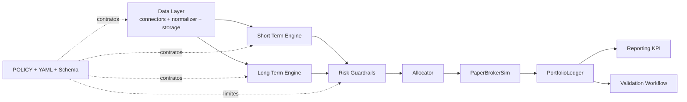
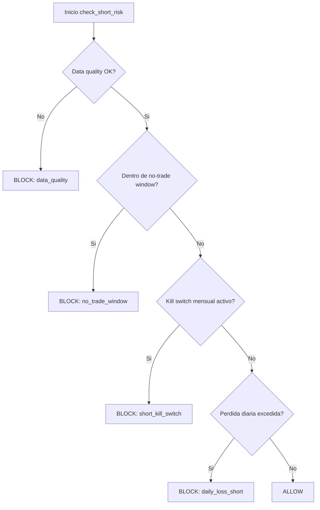
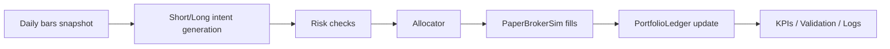

# Project Overview — Bot de Trading (paper-first)

Este documento esta pensado para dos usos:

- Servir como guion tecnico para una defensa oral.
- Permitir lectura simple para alguien que entra por primera vez al repo.

No busca reemplazar la documentacion normativa (`POLICY.md`) ni el registro de decisiones (`decisiones-tecnicas.md`), sino unir arquitectura, criterio y estado actual.

## 1) El problema y la filosofia

El problema que resuelve el proyecto es evitar decisiones de inversion manuales impulsivas y no reproducibles. El foco esta en construir un proceso estable, medible y auditable.

La filosofia base es:

- **Paper-first**: primero validar en simulacion con datos reales.
- **Riesgo deterministico en codigo**: los guardrails no dependen de prompts ni heuristicas opacas.
- **Proceso antes que rentabilidad**: subir exposicion solo despues de pasar gates definidos.
- **Trazabilidad completa**: cada regla relevante queda versionada en YAML, validada por schema y explicada en politica.

## 2) Arquitectura general

La arquitectura separa responsabilidades: data, engines, riesgo, ejecucion simulada, contabilidad y reporting. Esto permite evolucionar un bloque sin romper el resto.

### Decisiones clave de arquitectura

- Se separan **engines por horizonte** (`short_term_engine` diario y `long_term_engine` mensual) para no mezclar logicas con distintos tiempos de decision.
- El modulo `risk_guardrails` concentra reglas de bloqueo para tener un unico punto auditable.
- `event_engine` coordina el pipeline diario y evita que cada modulo defina su propio "orden de pasos".
- `paper_broker_sim` y `ledger` modelan ejecucion y PnL de forma estable antes de hablar de capital real.

## 3) Gestion de riesgo

El riesgo se implementa como reglas operativas explicitas, no como recomendaciones "blandas". El objetivo es que ante la misma entrada, la decision sea siempre la misma.

### Guardrails del bloque corto

`check_short_risk()` evalua en orden de severidad:

1. Calidad de datos.
2. Ventana no-trade intradia.
3. Kill switch mensual del bucket corto.
4. Limite de perdida diaria del bucket corto.

Si una regla bloquea, no se ejecutan entradas nuevas. La salida de cada evaluacion queda en logs estructurados para auditoria.

### Guardrails del bloque largo

`check_long_risk()` aplica un limite diario del sleeve largo y evita rebalanceos cuando el contexto excede el riesgo permitido.

### Stop loss por instrumento

`check_stop_loss()` usa ATR(14) cuando hay historia suficiente y fallback porcentual cuando no la hay. Un stop loss es una salida de riesgo y tiene prioridad operativa frente a bloqueos de nuevas entradas.

## 4) Motor de corto plazo

El corto plazo esta pensado para decisiones diarias y control estricto de exposicion:

- Genera candidatos con momentum y filtros de liquidez/volatilidad.
- Rankea por mercado y limita seleccion (`top_k_per_market`).
- Construye `orders_intent` con sizing por presupuesto de riesgo.
- Pasa por `risk_guardrails` antes de llegar al broker simulado.

En terminos de defensa oral, la idea central es: el motor no "adivina", **propone**; quien habilita o bloquea finalmente es el stack de riesgo.

## 5) Motor de largo plazo

El largo plazo trabaja con rebalanceo mensual por bandas de drift:

- Parte de pesos objetivo definidos en policy/config.
- Mide desvio entre peso actual y objetivo.
- Solo rebalancea si es dia valido de calendario y el drift supera el umbral.
- En v1, el satelite esta acotado y controlado por limites explicitos.

Este bloque apunta a estabilidad de cartera y menor rotacion relativa, complementando al motor corto que es mas tactico.

## 6) Datos, mercado y APIs

Esta seccion es critica porque sin calidad de datos no hay señal confiable ni riesgo valido.

### Fuentes y criterio de uso

- **US OHLCV**: `yfinance` con retry exponencial.
- **AR OHLCV**: IOL REST API como primario y fallback Byma/yfinance.
- **Calendarios**: `pandas_market_calendars` para sesiones US y AR.
- **Persistencia**: SQLite en `MarketDB`, con tablas para OHLCV, logs, fills y snapshots.

### Por que esta estrategia

- Evita dependencia unica de proveedor en AR mediante fallback.
- Separa errores de red de errores de datos para diagnostico claro.
- Mantiene pipeline reproducible: fetch -> normalize -> store.

### Tratamiento de calidad

- Deteccion de outliers y forward-fill acotado.
- Flags de degradacion para no ocultar problemas.
- Regla operativa: sin datos confiables, no se aumenta riesgo.

## 7) Paper broker y ledger

El `PaperBrokerSim` permite validar ejecucion sin riesgo de capital real:

- Simula fills deterministas.
- Aplica costos (comision, slippage, spread) con `CostModel`.
- Devuelve reportes de fill trazables.

El `PortfolioLedger` centraliza:

- Estado de posiciones.
- PnL realizado/no realizado.
- Curva de equity.
- Drawdown mensual del bucket corto.

## 8) Testing y calidad

La estrategia de testing prioriza comportamiento observable:

- Reglas de riesgo y bloqueos operativos.
- Integraciones del pipeline diario.
- Contrato de policy (YAML + schema + tests).
- Regresion de KPI con fixtures golden.

El objetivo no es "testear por cobertura", sino reducir riesgo de regresiones en decisiones de negocio (riesgo, sizing, ejecucion y validacion).

## 9) Decisiones tecnicas clave

Las decisiones se documentan en ADRs dentro de `decisiones-tecnicas.md`. Los ejes principales son:

- Paper-first como estrategia de construccion.
- Riesgo deterministico y centralizado.
- Motores desacoplados con nucleo comun.
- Contratos versionados (`policy.v1.yaml` + schema).
- Gate KPI OOS y ramp-up por escalones antes de live.

Para defensa oral, esta seccion muestra que la arquitectura no salio de una implementacion improvisada, sino de decisiones acumuladas y justificadas.

## 10) Metodologia con IA

La IA se uso como acelerador de implementacion y exploracion, no como reemplazo de criterio tecnico.

### Principios de uso

- Las decisiones de arquitectura, riesgo y policy se tomaron de forma explicita y versionada por el proyecto.
- La IA ayudo a iterar codigo, tests y estructura documental mas rapido.
- Cada cambio relevante se valido con contrato (schema/tests) y trazabilidad (ADR/changelog/policy).

### Controles de calidad sobre asistencia IA

- No se delega al modelo la logica de riesgo en runtime.
- Se evita acoplar comportamiento critico a prompts.
- Se exige validacion automatica y lectura critica humana antes de consolidar decisiones.

En una defensa oral, el punto central es demostrar gobernanza: **la IA fue herramienta**, el sistema de decisiones siguio siendo ingenieria controlada.

## 11) Trabajo pendiente

El proyecto esta funcional en paper-first, pero tiene frentes abiertos claros:

1. Acumular suficiente historia paper-live para evaluar completamente el gate OOS (hoy todavia en etapa de acumulacion).
2. Completar integracion operativa plena del bloque largo en el flujo diario de paper-live.
3. Cerrar brechas entre policy y ejecucion en puntos puntuales (por ejemplo, controles de concentracion sectorial en runtime si se habilitan como bloqueantes).
4. Fortalecer consistencia de metadata de mercado/APIs en todos los conectores (nombres de venue, contratos de proveedor y fallback).
5. Extender controles CI de cobertura y regresion a modulos fuera de `core_sim` con la misma disciplina.

Este capitulo existe para evitar una narrativa "cerrada". El sistema se presenta como una base robusta en evolucion, con backlog tecnico explicitado.

---

## Como usar este documento en defensa oral

- Abrir con secciones 1 y 2 (problema + arquitectura) para marcar contexto.
- Profundizar en 3, 4, 5 y 6 para explicar decisiones tecnicas.
- Usar 10 para explicar metodologia de construccion con IA.
- Cerrar con 11 para mostrar criterio, honestidad tecnica y roadmap.

Documentos complementarios:

- Politica operativa: `POLICY.md`
- Contrato parseable: `config/policy.v1.yaml`
- Validacion estructural: `config/policy.v1.schema.json`
- Registro de decisiones: `decisiones-tecnicas.md`
- KPI spec: `docs/kpi_report_spec.v1.md`
