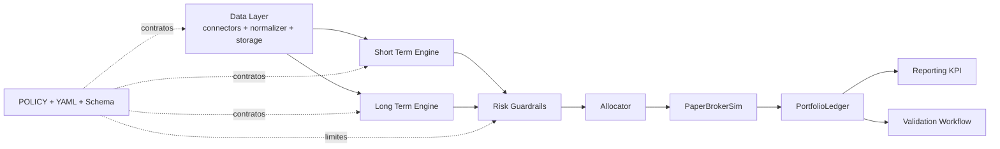
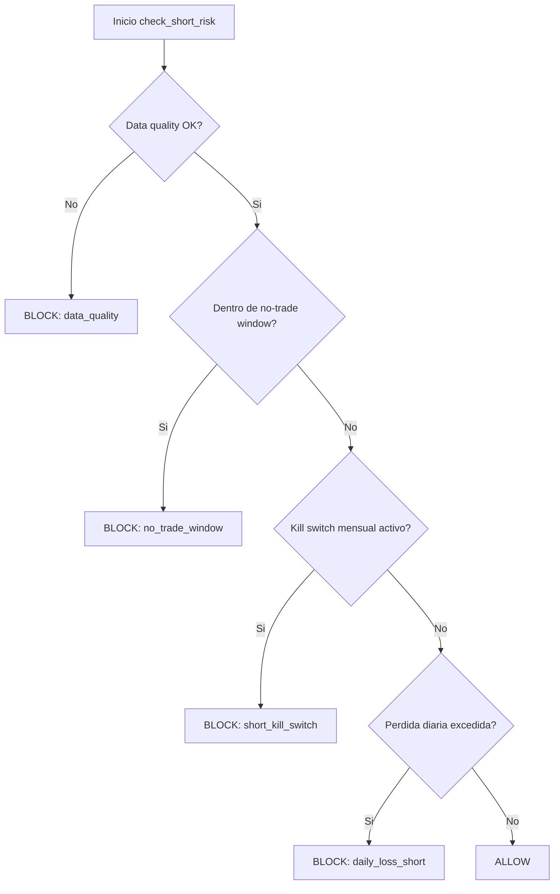
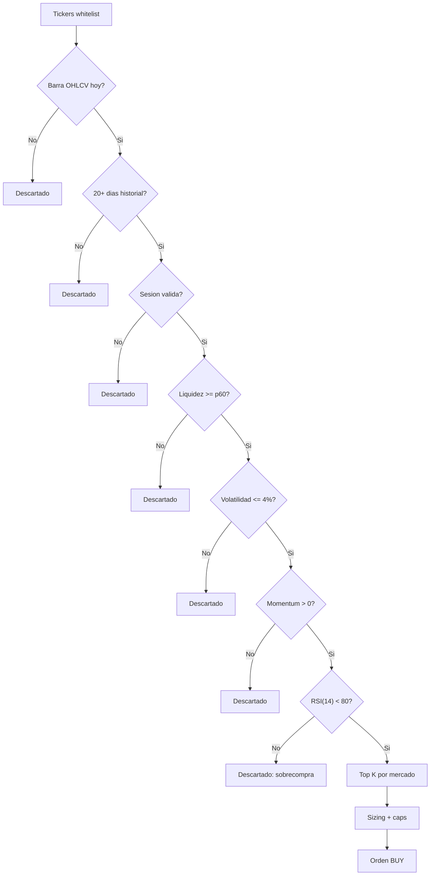
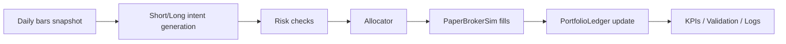
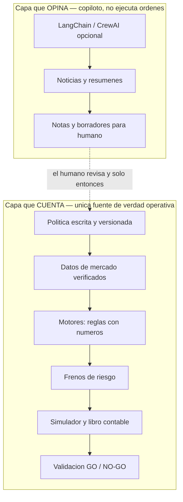

# Project Overview — Bot de Trading (paper-first)

Este documento esta pensado para dos usos:

- Servir como guion tecnico para una defensa oral.
- Permitir lectura simple para alguien que entra por primera vez al repo.

No busca reemplazar la documentacion normativa (`POLICY.md`) ni el registro de decisiones (`decisiones-tecnicas.md`), sino unir arquitectura, criterio y estado actual.

## 1) El problema y la filosofia

El problema que resuelve el proyecto es evitar decisiones de inversion manuales impulsivas y no reproducibles. El foco esta en construir un proceso estable, medible y auditable.

La filosofia base es:

- **Paper-first**: primero validar en simulacion con datos reales.
- **Riesgo deterministico en codigo**: los guardrails no dependen de prompts ni heuristicas opacas.
- **Proceso antes que rentabilidad**: subir exposicion solo despues de pasar gates definidos.
- **Trazabilidad completa**: cada regla relevante queda versionada en YAML, validada por schema y explicada en politica.

## 2) Arquitectura general

La arquitectura separa responsabilidades: data, engines, riesgo, ejecucion simulada, contabilidad y reporting. Esto permite evolucionar un bloque sin romper el resto.

### Decisiones clave de arquitectura

- Se separan **engines por horizonte** (`short_term_engine` diario y `long_term_engine` semanal) para no mezclar logicas con distintos tiempos de decision.
- El modulo `risk_guardrails` concentra reglas de bloqueo para tener un unico punto auditable.
- `event_engine` coordina el pipeline diario y evita que cada modulo defina su propio "orden de pasos".
- `paper_broker_sim` y `ledger` modelan ejecucion y PnL de forma estable antes de hablar de capital real.

## 3) Gestion de riesgo

El riesgo se implementa como reglas operativas explicitas, no como recomendaciones "blandas". El objetivo es que ante la misma entrada, la decision sea siempre la misma.

### Guardrails del bloque corto

`check_short_risk()` evalua en orden de severidad:

1. Calidad de datos.
2. Ventana no-trade intradia.
3. Kill switch mensual del bucket corto.
4. Limite de perdida diaria del bucket corto.

Si una regla bloquea, no se ejecutan entradas nuevas. La salida de cada evaluacion queda en logs estructurados para auditoria.

### Guardrails del bloque largo

`check_long_risk()` aplica un limite diario del sleeve largo (-1.5% del equity largo) y evita rebalanceos cuando el contexto excede el riesgo permitido. El insumo `long_daily_return` se calcula en el `PortfolioLedger` (comparacion contra MTM del dia habil anterior) y se expone via `long_bucket` en el snapshot de `mark_to_market`. El runner largo extrae esta key explicitamente — no depende de un default implicito 0.0.

### Stop loss por instrumento

`check_stop_loss()` usa ATR(14) cuando hay historia suficiente y fallback porcentual cuando no la hay. Un stop loss es una salida de riesgo y tiene prioridad operativa frente a bloqueos de nuevas entradas.

## 4) Motor de corto plazo

El corto plazo esta pensado para decisiones diarias y control estricto de exposicion:

- Genera candidatos con momentum y filtros de liquidez/volatilidad.
- **Filtra sobrecompra con RSI(14)**: si `RSI > rsi_overbought_entry` (default **80** en `policy.v1.yaml`), el candidato se descarta con motivo `rsi_overbought`. Esto evita entrar en tickers cuyo momentum es positivo pero cuya velocidad de suba sugiere reversion.
- Rankea por mercado y limita seleccion (`top_k_per_market`).
- Construye `orders_intent` con sizing por presupuesto de riesgo.
- Pasa por `risk_guardrails` antes de llegar al broker simulado.
- **Salida anticipada por RSI**: para posiciones abiertas del bucket corto, si RSI cruza descendentemente el umbral `rsi_exit_threshold` (default 45) — es decir, ayer >= umbral y hoy < umbral — se genera una orden SELL con motivo `rsi_momentum_exhausted`. El crossover evita salidas falsas cuando RSI simplemente esta bajo y estable.
- **Contadores de auditoria**: cada ventana OOS reporta `entries_blocked_by_rsi`, `exits_by_rsi` y `exits_by_stop_loss` para explicar por que cambio el resultado.

En terminos de defensa oral, la idea central es: el motor no "adivina", **propone**; quien habilita o bloquea finalmente es el stack de riesgo. RSI complementa al momentum (no lo reemplaza): momentum dice "sube", RSI dice "se paso de rosca".

## 5) Motor de largo plazo

El largo plazo trabaja con rebalanceo por bandas de drift en cadencia **semanal o mensual** según policy:

- Parte de pesos objetivo definidos en policy/config (`long_term_engine`).
- En el **default del repo**: calendario **AR** (`first_ar_business_day_of_calendar_week` o mensual), datos diarios y calendario de validación en venue **XBUE** (BYMA / pesos), core en acciones locales y satélite en **CEDEAR** (p. ej. **SPY** como proxy del índice en ARS). Variante documentada: sleeve **US** con `first_us_trading_day_of_*` y **XNYS**.
- Mide desvio entre peso actual y objetivo.
- Solo rebalancea si es dia valido de calendario (sesiones AR o US según regla) y el drift supera el umbral.
- En v1, el satelite esta acotado y controlado por limites explicitos cuando aplica (`satellite_limits`).
- **Guardrail efectivo**: `check_long_risk()` recibe `long_daily_return` real desde `long_bucket` del ledger. Si el sleeve largo pierde mas de 1.5% en el dia, se bloquean nuevos rebalanceos.

El **stage informativo** `validation/stages/long_engine.run_long_engine_stage` ejecuta ese pipeline sobre SQLite: para policy AR usa **solo** XBUE para fechas y OHLCV (no exige tabla `calendars` XNYS). En **paper-live** con `--enable-long-engine`, las barras que ve el largo AR se alinean a **XBUE** por ticker de policy aunque el merge del corto marque el mismo símbolo como US (**ADR-048**).

Este bloque apunta a estabilidad de cartera y menor rotacion relativa, complementando al motor corto que es mas tactico.

## 6) Datos, mercado y APIs

Esta seccion es critica porque sin calidad de datos no hay señal confiable ni riesgo valido.

### Fuentes y criterio de uso

- **US OHLCV**: `yfinance` con retry exponencial (`data/connectors/us_connector.py`).
- **AR OHLCV**: IOL REST API como primario y fallback Byma/yfinance (`data/connectors/ar_connector.py`).
- **Calendarios**: `pandas_market_calendars` para sesiones US (XNYS) y AR (XBUE). Persistencia en DB: `data/calendar_builder.py`. YAML versionado para paper-live: `scripts/build_trading_days_yaml.py` → `config/calendars/trading_days.v1.yaml` (**ADR-054**). Stub de 4 dias solo en `tests/fixtures/calendars/`.
- **Venue por moneda (`data/venue_policy.py`)**: fuente unica que mapea cada `market` tag a sus venues — US → `("XNYS","US")` (USD; `"US"` legacy de ADR-037, menor precedencia) y AR → `("XBUE",)` (ARS). Los lectores de `ohlcv` que arman series por simbolo (medicion de senal `reporting/signal_ic.py`, pre-gate corto) **filtran por venue** segun el tag del simbolo: nunca mezclan monedas. Regla dura: venue **por serie, no por dia**; si falta la barra del venue correcto un dia, se omite (no se sustituye con la otra moneda). La senal de los dual-listed se computa en **USD**; los AR-nativos en **ARS** (**ADR-052**).
- **Persistencia**: SQLite en `MarketDB` (`data/storage.py`), con tablas para OHLCV, logs, fills, snapshots y kill switch.
- **Benchmark**: `data/benchmark_returns.py` genera retornos de un benchmark mixto 20/80 (AR/US) point-in-time, sin lookahead, usando cierres disponibles hasta cada fecha de valoracion. Se usa en el informe KPI para calcular alpha vs pasivo.

### Por que esta estrategia

- Evita dependencia unica de proveedor en AR mediante fallback.
- Separa errores de red de errores de datos para diagnostico claro.
- Mantiene pipeline reproducible: fetch -> normalize -> store (`data/fetcher.py` + `data/normalizer.py`).

### Universo AR hibrido (liquidez + holdings)

Cuando `symbols.universe_selection.enabled` esta activo en `config/policy.v1.yaml`:

- **Ranking**: sobre candidatos Merval y CEDEAR (YAML dedicados), se ordena por volumen total en una ventana fija de dias habiles usando historia **solo IOL** (sin distorsion Byma/yfinance en la seleccion). Desempates deterministas: notional medio descendente (`close × volume`), luego ticker ascendente.
- **Rebalanceo**: cadencia policy-driven (por defecto **semanal**): si la corrida no debe refrescar el ranking, se **reutiliza la ultima seleccion persistida** en `universe_snapshots` (fallback controlado frente a presupuesto o calendario).
- **Ingesta OHLCV**: la lista AR que consume `fetch_and_store` no es solo el top por volumen: es **`merge(top_merval, top_cedear, holdings_AR_abiertos)`** ordenado y sin duplicados. Si un ticker sigue en cartera AR (`qty ≠ 0` replay desde fills en DB paper-live), **sigue descargandose aunque haya salido del top**, para MTM, riesgo y salidas coherentes.
- **Motor corto vs barras**: `resolve_ar_universe_for_short_pipeline` alimenta `load_merged_whitelist(..., ar_operational_symbols=...)` con ese conjunto de barras; el ranking de candidatos puede limitarse al top de liquidez (`ar_signal_symbols`) para no ensanchar senales con ilícitos fuera del universo operativo.
- **Presupuesto API**: contadores por tipo en SQLite (`iol_api_usage`), limite mensual (warning al pasar umbral soft, sin ranking nuevo si hard), y **tope duro por job** que aborta la seleccion dinamica y cae a ultimo snapshot o whitelist estatica.

Detalle y fuentes en **ADR-047** (`decisiones-tecnicas.md`).

### Tratamiento de calidad

- Deteccion de outliers (rolling 5d median, ×10 / ÷10) y forward-fill acotado (≤3 dias, marcado como `imputed=True`).
- **Guardrail de salto de ratio** (`suspect_ratio_jump`): un cierre que mas que duplica o cae a menos de la mitad del cierre valido anterior se descarta con warning. Captura cambios de ratio CEDEAR o splits **no registrados** que el filtro de outliers (basado en mediana) dejaba pasar. Caso origen: el CEDEAR de **SPY** cambio de ratio 1:3 el 2026-05-29 (close 56.000 → 18.750 ARS); el back-adjust se aplica con `scripts/adjust_cedear_ratio.py`, que ademas registra el evento en `corporate_actions`.
- Flags de degradacion para no ocultar problemas.
- Regla operativa: sin datos confiables, no se aumenta riesgo.

### Trazabilidad de ingesta (`fetch_log`, ADR-049)

Cada corrida de `scripts/fetch_daily.py` / `fetch_and_store` registra **un evento por simbolo y rango de fechas** en la tabla SQLite `fetch_log` (via `MarketDB.log_fetch` y taxonomia en `data/fetch_trace.py`).

| Campo | Uso |
|-------|-----|
| `status` | `ok`, `skip` o `error` |
| `source` / `effective_source` | Fuente efectiva: `iol`, `byma`, `yfinance` o `mixed` |
| `skip_reason` | Detalle si no hubo `ok` (p. ej. `fallback_used`, `empty_data`, `credentials_missing`) |
| `extra` (JSON) | `rows_by_source`, `partial_fallback`, `attempts`, `iol_only`, fechas del job |

**Comportamiento AR relevante:**

- Si IOL responde bien para todo el calendario **XBUE** del rango → solo IOL.
- Si IOL falla por completo → fallback Byma/yfinance; se audita `{iol: 0, byma: N}`.
- Si IOL devuelve **datos parciales** (faltan sesiones segun calendario XBUE pasado por el fetcher) → merge por fecha (IOL gana en empate), `source=mixed`, `partial_fallback=true` y conteos en `rows_by_source`.
- Variable de entorno opcional `FETCH_IOL_ONLY=1|true|yes` fuerza ingesta AR solo por IOL (sin fallback en el job diario).

El ranking dinamico en `universe_selector` **no** activa merge parcial (no pasa calendario explicito); el job diario con calendario en DB si.

Detalle de decision en **ADR-049** (`decisiones-tecnicas.md`). Granularidad **por barra** en `ohlcv` queda fuera de alcance (fase 2.1 opcional).

### Ampliacion del universo (ADR-053)

Tras corregir la mezcla de monedas (**ADR-052**), la medicion de senal revelo **breadth insuficiente**: mediana ~1 simbolo/dia y solo 89/278 dias con >=5 nombres — veredicto inconcluso por falta de amplitud, no por defecto del fix de venue.

Se agregaron **10 simbolos diversificados por industria**:

- **Merval** (market `AR`, XBUE/ARS): `CRES`, `TECO2`, `LOMA`, `MIRG`, `IRSA`.
- **CEDEARs** (tag `US` → senal en USD via XNYS; tambien en `whitelist_cedear` para ejecucion futura): `V`, `UNH`, `CAT`, `PEP`, `NFLX`.

Pendiente: re-correr la medicion IC/hit rate sobre la cross-section completa con datos limpios.

### Medicion de senal (capa de research, sin ejecucion)

Modulos offline que evaluan si el ranking del motor corto tiene edge predictivo — **no** mueven ordenes ni tocan `run_paper_live.py`:

| Modulo | Rol |
|--------|-----|
| `reporting/signal_ic.py` | IC de ranking, hit rate@K, quantile spread, curva de decay; filtra venue por market tag (**ADR-052**) |
| `reporting/scenario.py` | Escenarios what-if con overrides parametricos de `short_term_engine` |
| `reporting/data_quality_envelope.py` | Envoltorio de confianza (`stale_marks`, `imputed_pct`, umbrales policy) |
| `scripts/run_signal_ic_now.py` | CLI de medicion IC sobre `data/market.db` |
| `scripts/run_scenario.py` | CLI de escenarios what-if (IC / señal) |
| `scripts/run_whatif_sim.py` | Simulacion what-if de **cartera** 30/70 sobre copia aislada de DB (fills, equity, posiciones); no paper-live productivo |

Tras limpiar la mezcla USD/ARS, el IC a h=1 cayo de 0.146 a 0.087 (~40 % del edge aparente era artificial). La narrativa completa de complicaciones encadenadas esta en `docs/complicaciones-tecnicas.md`.

**Limitacion de datos (jun 2026)**: OHLCV **XBUE** en `market.db` termina **2026-06-02** mientras **XNYS** llega a 2026-06-09. Backtests o sims que extienden mas alla del 02-jun pueden valuar posiciones AR en pesos con precios USD (fallback) y distorsionar equity. `run_whatif_sim.py` cierra por defecto en 2026-06-02. El ratio CEDEAR de **SPY** (salto 1:3 del 2026-05-29) ya quedo **ajustado** en la DB (back-adjust + guardrail; ver "Tratamiento de calidad"). Pendiente: extender el fetch AR para alinear el corte XBUE con XNYS.

### Diagnostico pre-gate (`notebooks/pre_gate_diagnostic.ipynb`)

Notebook operativo para revisar datos y motor **antes** de confiar en el pre-gate walk-forward:

1. **Universo dinamico** — deja de usar listas hardcodeadas: carga US desde `whitelist_us`, AR desde policy + ultimo `universe_snapshots` (o whitelist estatica + holdings abiertos), alineado a `fetch_daily`.
2. **Cobertura OHLCV** — paneles y heatmaps separados **US (XNYS)** y **AR/CEDEAR (XBUE)** contra el tamano del universo efectivo.
3. **Calidad de datos IOL** — lee `fetch_log` en el lookback: tasas de exito y fallback, `skip_reason`, fuente efectiva, simbolos con fallos recurrentes (requiere al menos una corrida de `fetch_daily` post ADR-049).
4. **Pre-gate / motor** — ventanas OOS desde `outputs/pre_gate_windows_180d_rsi.json` (fills, return, drawdown).
5. **Diagnostico automatico** — flags agrupados por IOL, datos (US/AR) y motor.

Ejecutar con `data/market.db` poblada; si `fetch_log` esta vacio, la seccion IOL avisa y el resto del notebook sigue.

## 7) Paper broker y ledger

El `PaperBrokerSim` permite validar ejecucion sin riesgo de capital real:

- Simula fills deterministas.
- Aplica costos (comision, slippage, spread) con `CostModel`.
- Devuelve reportes de fill trazables.

El `PortfolioLedger` centraliza:

- Estado de posiciones.
- PnL realizado/no realizado.
- Curva de equity.
- Drawdown mensual del bucket corto (`short_bucket`), sobre equity del bucket (`short_cash + MV_short`), no solo MV de posiciones abiertas.
- **Daily return del sleeve largo** (`long_bucket` con `long_daily_return` y `long_equity`), calculado como variacion vs MTM del dia habil anterior.
- **Valuacion resiliente a huecos** (**ADR-051**): si falta barra del dia, carry-forward del ultimo close (o `avg_cost` si nunca se vio precio); el snapshot expone `stale_marks` y flag `stale` por posicion. Evita crash en `run_validation_wf` ante un solo hueco (ej. TXAR).

## 8) Paper-live y modelo de branches

### Orquestador diario

`scripts/run_paper_live.py` ejecuta el pipeline dia a dia contra OHLCV real en SQLite:

- Detecta el ultimo dia procesado (`get_last_snapshot_day("paper_live")`) y hace catch-up idempotente de los dias faltantes. El **conteo de gap para F3** usa la union de sesiones US (XNYS) y dias habiles AR (XBUE) del calendario versionado — no lun-vie generico (**T1.4**, **ADR-055**). Fallback lun-vie solo con `--no-calendar`.
- **Calendario obligatorio** (**ADR-054**): carga `policy.calendar.source_of_truth` (`config/calendars/trading_days.v1.yaml` por defecto) **antes** del check F3 y del catch-up. Si falta o esta vacio → `exit 1`. Regenerar: `python scripts/build_trading_days_yaml.py`. Flag `--no-calendar` solo para tests.
- **`portfolio_meta` (T1.1)**: capital inicial y moneda bloqueados tras primera corrida; mismatch CLI vs DB → `exit 1`.
- **`short_cash` (T1.3)**: columna `paper_snapshots.short_cash` = `ledger.short_cash` (ADR-039 / ADR-055).
- **Politica F3**: si el gap supera **3** dias de mercado (segun calendario), `exit(2)` y requiere intervencion manual (no hace catch-up masivo automatico). Ver **ADR-050**, **ADR-055** y `POLICY.md` §15.
- Si un dia del gap **no tiene barras** (feriado AR, mercado cerrado, fetch incompleto), registra **warning y continua** con el siguiente dia — no aborta todo el rango (**ADR-050**).
- Persiste fills y snapshots en `data/market.db` bajo mode `paper_live`.
- Replay de ledger desde fills anteriores para mantener estado coherente (`replay_ledger_from_fills`). Regresion: golden fixture en `tests/fixtures/replay_golden/` + `tests/test_replay_golden.py`.
- **Soporte para ambos sleeves**: con `--enable-long-engine` se ejecuta el pipeline corto primero y luego el largo sobre el mismo ledger/broker. Los fills de ambos sleeves se persisten juntos. Sin el flag (default), el flujo es solo corto — rollback inmediato sin cambio de codigo.
- Tras el corto, si el largo esta activo y el policy usa calendario **AR**, una copia de `daily_bars` recibe precios **XBUE** por cada simbolo de `long_term_engine` (motor CEDEAR/pesos; **ADR-048**). El snapshot final usa esa copia para MTM cuando el flag esta encendido.
- Orden fijo **short → long**: el largo consume la caja que quedo despues del corto.

**Exit codes** (`run_paper_live.py`): `0` OK; `1` error de runtime (calendario faltante, datos faltantes en dia que si debia operar, crash); `2` violacion F3 (gap > 3).

### Workflow automatizado

`.github/workflows/paper_live_daily.yml` corre de lunes a viernes a las 10:00 UTC y procesa por defecto el **dia habil de mercado anterior** (no el dia en curso); admite **`workflow_dispatch`** con input opcional `date` (`YYYY-MM-DD`):

1. Checkout de rama **`paper-live-data`** (LFS activo para `data/market.db`).
2. `pip install -r requirements.lock` — versiones **exactas** (pins `==`) para que el bot instale lo mismo cada dia; `requirements.txt` queda como archivo de intencion (rangos). Python **3.13** (alineado con dev local). Sync a Supabase es dependencia opcional aparte (`requirements-optional.txt`).
3. Fetch OHLCV (`fetch_daily.py --lookback 5`) con secrets **`IOL_USER`** / **`IOL_PASS`** inyectados desde GitHub Actions (no desde el PC del operador).
4. `run_paper_live.py` (con `--date` si se disparo dispatch manual).
5. `git add -f data/market.db` + commit/push si hubo cambios.
6. Issue automatico si falla cualquier step (**ADR-040**).

**Secretos IOL (critico):** deben existir en el repo de GitHub. Variables de entorno locales (Windows `setx`, panel de usuario) **no** llegan al runner. Sin secrets, el fetch AR degrada y el catch-up puede fallar. Diagnostico local: `python scripts/diagnose_iol_auth.py`. Incidente y runbook: **ADR-050**.

**IOL histórico 401 (conocido):** el login (`/token`) puede responder 200 y la serie historica 401; el conector reintenta y cae a Byma/yfinance. El workflow puede quedar en verde; revisar `fetch_log` para calidad AR.

### Recuperacion tras caida (runbook)

| Situacion | Accion |
|-----------|--------|
| Gap ≤ 3 dias | Dejar que el cron o un `workflow_dispatch` sin fecha lo procese. |
| Gap > 3 dias (F3) | Varios dispatch con `date` = ultimo dia de cada bloque de ≤3 dias de mercado (calendario US∪AR), o local: `fetch_daily --lookback 120` + `run_paper_live --date ...` en tandas + push a `paper-live-data`. |
| Conflicto al `pull` en `data/market.db` | Puntero LFS: `git checkout --ours data/market.db` (DB local) o `--theirs` (remoto), `git add`, commit merge. No editar `<<<<<<<` en el puntero. |
| Codigo nuevo en `main` | `git checkout paper-live-data && git merge main` antes de operar localmente. |

### Modelo de branches

| Rama | Proposito | Que se commitea |
|------|-----------|-----------------|
| `main` | Evolucion de codigo, PRs, CI | Solo codigo y docs |
| `paper-live-data` | Operacion diaria automatizada | Codigo + `data/market.db` (via Git LFS) |

El workflow vive en `main` (GitHub lee schedule/dispatch del default branch), pero hace checkout de `paper-live-data` para ejecutar. Git LFS para `data/*.db` evita inflar el repo con commits binarios diarios (~250/año). Los commits diarios del bot (`paper-live: YYYY-MM-DD daily run`) solo van a `paper-live-data`.

## 9) Validation workflow (GO/NO-GO)

El modulo `validation/` implementa un pipeline de validacion automatica que evalua si el sistema esta en condiciones operativas. Produce un `ValidationReport` con decision binaria GO/NO-GO.

### Stages

Cada stage es independiente y retorna `StageResult` con metricas, violaciones y flag de skip:

1. **`data_quality`**: verifica integridad y frescura de datos OHLCV.
2. **`short_pre_gate`**: ejecuta walk-forward OOS del bloque corto y evalua metricas contra umbrales.
3. **`long_engine`**: valida comportamiento del motor largo (drift, rebalanceos, turnover). `run_long_engine_stage` retorna siempre `(StageResult, StageDetails | None)`; con `return_details=True` expone curva diaria de equity del **sleeve largo**, fills y posiciones finales para analisis fuera del JSON agregado (**ADR-046**).
4. **`risk_audit`**: audita que los guardrails actuaron correctamente en la historia reciente.
5. **`kill_switch_history`**: verifica historial de activaciones/resets del kill switch.

El runner (`validation/runner.py`) orquesta las 5 etapas y agrega la decision global. Script: `scripts/run_validation_wf.py`.

### Walk-forward del largo (CLI) vs comparacion en notebook

| Artefacto | Proposito | Salida |
|-----------|-----------|--------|
| `validation/wf_runner.py` + `scripts/run_long_engine_wf.py` | Varias ventanas rolling; metricas agregadas por ventana y summary global | `validation_reports/long_engine_wf_*.json` (**ADR-027**) |
| `notebooks/wf_long_comparison.ipynb` | Evidencia empirica de **ADR-045**: semanal vs mensual vs buy-and-hold SPY (abr-2025 → may-2026) | WF 3m/paso 1m + viz por ventana; corrida continua sin reset (`continuous_equity_df`) (**ADR-046**) |

El CLI WF no cambia de contrato: `wf_runner` sigue consumiendo solo el `StageResult` (`[0]` de la tupla). El notebook pide detalle con `return_details=True` y, para la regla mensual, una copia del `policy_doc` con `rebalance_rule` sobrescrito por corrida.

Flujo del notebook (**ADR-046**, pasos 3–4):

1. Carga `data/market.db` y ventanas `generate_wf_windows(3, 1)` sobre calendario XNYS.
2. Por ventana: stage largo semanal, mensual y curva SPY → `equity_df` + `windows_df`.
3. Métricas por ventana: retorno total, Sharpe anualizado (√252), MDD desde equity diaria.
4. Cuatro vistas: subplot grid base 100, tabla pivote, barra de retorno promedio, MDD agrupado por ventana.
5. Corrida continua sobre todo el calendario (paso 5): tres curvas superpuestas en USD y en base 100.

## 10) Testing y calidad

La estrategia de testing prioriza comportamiento observable:

- Reglas de riesgo y bloqueos operativos.
- Integraciones del pipeline diario.
- Contrato de policy (YAML + schema + tests).
- Regresion de KPI con fixtures golden.
- Validation stages (data quality, risk audit, kill switch history, motores corto/largo).
- Filtro de venue en senal y pre-gate (`test_venue_policy`, `test_signal_ic_venue_filter`, `test_validation_short_pre_gate_venue`).
- Escenarios what-if y envelope de calidad (`test_scenario`, `test_data_quality_envelope`).

El repo cuenta con **56 archivos de test** y **635 casos** recolectados (`pytest --collect-only`), abarcando unitarios, integracion y regresion. Cobertura minima de `core_sim` >= 80 % en CI. El objetivo no es "testear por cobertura", sino reducir riesgo de regresiones en decisiones de negocio (riesgo, sizing, ejecucion, validacion y medicion de senal).

## 11) Decisiones tecnicas clave

Las decisiones se documentan en ADRs dentro de `decisiones-tecnicas.md` (**54 ADRs**, hasta ADR-055). Los ejes principales son:

- Paper-first como estrategia de construccion.
- Riesgo deterministico y centralizado.
- Motores desacoplados con nucleo comun.
- Contratos versionados (`policy.v1.yaml` + schema).
- Gate KPI OOS con umbrales pre-registrados y ramp-up gradual en 5 escalones (**ADR-041**).
- RSI(14) como filtro de entrada y señal de salida del motor corto (**ADR-042**): mejoro avg max drawdown de -0.134% a -0.098% y redujo turnover de 1.69 a 1.26 en walk-forward 180d; umbral de sobrecompra actual **80** en `policy.v1.yaml`.
- Modelo de branches `main` / `paper-live-data` con LFS y notificaciones (**ADR-040**); runbook CI/secretos/F3/feriados (**ADR-050**).
- ADRs argentinos (MELI, YPF, TGS, GGAL) incorporados al whitelist US con precedencia de tag y categoría `adrs` separada (**ADR-043**).
- Integración del largo en paper-live con guardrail efectivo, dedup de riesgo corto y feature flag de rollback (**ADR-044**).
- Rebalanceo largo semanal vs mensual: cambio operativo en policy (**ADR-045**); evidencia en notebook WF + corrida continua (**ADR-046**).
- Valuacion resiliente a huecos de datos en ledger (**ADR-051**): carry-forward + `stale_marks`.
- Senal sin mezcla de monedas: `data/venue_policy.py` + filtro de venue en lectores de OHLCV (**ADR-052**).
- Ampliacion del universo (+10 simbolos) para destrabar medicion de senal (**ADR-053**).

Para defensa oral, esta seccion muestra que la arquitectura no salio de una implementacion improvisada, sino de decisiones acumuladas y justificadas. Las complicaciones vividas (encadenadas) se narran en `docs/complicaciones-tecnicas.md`.

## 12) Metodologia con IA

La IA se uso como acelerador de implementacion y exploracion, no como reemplazo de criterio tecnico.

### Principios de uso

- Las decisiones de arquitectura, riesgo y policy se tomaron de forma explicita y versionada por el proyecto.
- La IA ayudo a iterar codigo, tests y estructura documental mas rapido.
- Cada cambio relevante se valido con contrato (schema/tests) y trazabilidad (ADR/changelog/policy).

### Controles de calidad sobre asistencia IA

- No se delega al modelo la logica de riesgo en runtime.
- Se evita acoplar comportamiento critico a prompts.
- Se exige validacion automatica y lectura critica humana antes de consolidar decisiones.

En una defensa oral, el punto central es demostrar gobernanza: **la IA fue herramienta**, el sistema de decisiones siguio siendo ingenieria controlada.

## 12.1) Ultimo cambio estructural: integracion del largo (ADR-044)

En la integracion del sleeve largo en paper-live se arreglaron tres cosas que estaban rotas o a medias:

**El guardrail del largo no funcionaba.** El sistema tenia un limite de perdida diaria del -1.5% para el sleeve largo, pero en la practica nunca se activaba. El codigo buscaba un dato (`long_daily_return`) que nadie calculaba, asi que siempre valia 0.0 y el limite nunca disparaba. Ahora el ledger calcula ese retorno diario de verdad (comparando equity largo hoy vs ayer) y el runner largo lo usa para decidir si bloquea rebalanceos.

**El motor largo no corria en paper-live.** El orquestador diario (`run_paper_live.py`) solo ejecutaba el pipeline corto. Ahora puede correr ambos — primero el corto, luego el largo sobre el mismo ledger — con un flag `--enable-long-engine`. Si algo sale mal, se apaga el flag y se vuelve a solo-corto sin tocar codigo.

**La logica de riesgo corto estaba duplicada.** Habia dos lugares en el codigo con los mismos 4 checks de riesgo copiados a mano (calidad de datos, ventana no-trade, kill switch, limite diario). Si se cambiaba uno, habia que acordarse de cambiar el otro. Ahora uno llama al otro — una sola fuente de verdad.

## 12.2) LangChain, CrewAI y capas de confianza (probabilidad vs matematica fija)

Esta seccion aclara por que el proyecto **no** usa frameworks de agentes LLM en el path de ejecucion, y como podrian complementar el sistema mas adelante sin romper la filosofia paper-first.

### Que son (breve)

- **LangChain** ([documentacion](https://docs.langchain.com/oss/python/langchain/overview)): framework open source para conectar modelos de lenguaje con datos externos, herramientas (tools) y flujos de agente. Su foco es estandarizar integraciones y orquestar pasos donde el LLM decide que herramienta usar (patron tipo ReAct).
- **CrewAI** ([introduccion](https://docs.crewai.com/en/introduction)): framework orientado a **equipos de agentes** con rol, objetivo y colaboracion. Combina **Flows** (orquestacion y estado) con **Crews** (grupos de agentes que resuelven tareas delegadas).

Ambos son utiles cuando el problema es **lenguaje natural, ambiguedad o investigacion abierta**. No reemplazan reglas de trading versionadas y testeables.

### Ventajas que podrian aportar (fuera del nucleo)

| Ventaja | Ejemplo de uso compatible con este repo |
|---------|----------------------------------------|
| Velocidad en tareas textuales | Resumir filings, notas o logs de paper-live para revision humana |
| Multi-agente para research | Un crew "analista + revisor" que contrasta un borrador de `POLICY.md` o un diff de policy |
| Integracion con muchas APIs | Prototipos de copiloto que leen fuentes heterogeneas sin cablear cada conector a mano |
| Exploracion de hipotesis | Brainstorm de indicadores o escenarios en notebook, **sin** tocar `run_paper_live.py` (p. ej. `notebooks/wf_long_comparison.ipynb` para ADR-045/046) |

### Por que no se usan en ejecucion ni en riesgo

La decision formal esta en **ADR-002** (`decisiones-tecnicas.md`): los limites de riesgo (kill switch, perdida diaria, ventanas sin operar, etc.) estan escritos como **reglas fijas en codigo**, no como instrucciones a un modelo de lenguaje.

En una defensa oral conviene usar esta imagen: hay dos tipos de "empleados" en el sistema.

| | **Capa que "opina"** (LLM / LangChain / CrewAI) | **Capa que "cuenta"** (reglas del bot) |
|---|---|---|
| Pregunta que responde | "Que significa este titular o este texto?" | "Con estos numeros de hoy, opero o no?" |
| Misma situacion manana | Puede cambiar la redaccion o el enfasis | Debe dar la **misma** respuesta |
| Si se equivoca | Perdes tiempo revisando un resumen | Podrias operar cuando no debias, o no frenar a tiempo |

Por eso LangChain y CrewAI **no** van en el camino que termina en ordenes (ni siquiera en paper): solo sirven como **copiloto de investigacion**, nunca como caja fuerte.

**Tres motivos, en lenguaje llano:**

1. **Reproducibilidad** — El proyecto promete: mismos datos + misma politica = misma decision. Un modelo de lenguaje es probabilistico: puede responder distinto aunque los precios no cambien. Eso impide repetir un experimento con confianza y complica las pruebas automaticas (walk-forward, tests en CI).
2. **Auditoria** — Si algo sale mal, hay que explicar *que regla* actuo. El bot deja motivos explicitos en logs (por ejemplo: "bloqueado por perdida diaria del bucket corto"). Decir "la IA lo interpreto asi" no es una auditoria defendible ante un jurado ni ante uno mismo seis meses despues.
3. **Riesgo de interpretacion** — Los modelos son fuertes con texto ambiguo y debiles si no hay red de seguridad numerica: pueden confundir magnitudes, inventar un dato que no estaba en el mercado, o llamar mal a una herramienta externa. Un resumen mal hecho molesta; un error en tamano de posicion o en un freno de riesgo duele.

Un cuarto motivo practico: **costo y tiempo** — un equipo de agentes hace muchas llamadas al modelo por dia; el pipeline paper-live debe ser rapido y estable.

**Aclaracion:** los "roles" de `AGENTS.md` (Spec, Risk, Engines) organizan **como trabajamos en el repo** (humanos y asistente del IDE). No son agentes CrewAI corriendo cada manana en produccion.

### Que capa confias a la probabilidad y cual a la matematica fija

**Regla de oro para la defensa:** *el LLM propone ideas y texto; las reglas escritas y el codigo deciden el dinero* (aunque sea simulado en paper).

#### Capa probabilistica — confias en la interpretacion, no en la ejecucion

Aca va todo lo que **sugiere** y **ayuda a pensar**, siempre con revision humana antes de que pese en el sistema:

- Leer y resumir noticias, informes o logs largos.
- Proponer etiquetas ("macro", "resultados trimestrales", "riesgo regulatorio").
- Ayudar a redactar o revisar la politica del proyecto.
- Explorar hipotesis ("y si probamos otro filtro?") en chat o notebook.

**Nada de esto mueve una orden** hasta que una persona lo traduce a reglas versionadas y testeadas.

En el repo hoy: IA al construir el proyecto (seccion 12), notas en `knowledge-base/`, y en el futuro un posible copiloto de noticias **offline** (ver mas abajo).

#### Capa matematica fija — confias en numeros y reglas, no en opiniones

Aca va todo lo que **debe repetirse igual** cada dia y dejar rastro claro:

- Politica y limites versionados (`POLICY.md`, `config/policy.v1.yaml`).
- Calidad de los datos de mercado (precios, sesiones, alertas si faltan datos).
- Senales del motor corto y largo (momentum, RSI, bandas de rebalanceo, etc.).
- Frenos de riesgo centralizados (`risk_guardrails.py`): kill switch, limites diarios, ventanas sin operar.
- Simulacion de compra/venta y contabilidad (`PaperBrokerSim`, `PortfolioLedger`).
- Validacion global GO / NO-GO antes de confiar en el sistema.

Si manana preguntas "por que no compro?", la respuesta debe ser un **umbral o una regla**, no "el modelo lo sintio".

| Para explicar en oral | Capa probabilistica | Capa matematica fija |
|----------------------|---------------------|----------------------|
| Analogia | Asistente de investigacion en el escritorio | Caja fuerte con combinacion en el contrato |
| Que confias | Criterio sobre texto y prioridades para revisar | Umbrales, bloqueos, tamanos, simulacion, gates |
| Donde vive en el repo | Seccion 12, `knowledge-base/`, futuro research LLM | Policy YAML, motores, `risk_guardrails`, broker paper, `validation/` |

### Mejora futura posible (investigacion, sin senal directa)

Escenario acotado, alineado a ADR-002:

1. **Ingesta diaria** de titulares o notas (API/RSS/archivo), fuera del horario critico de `run_paper_live`.
2. **Crew o agente LangChain** que resume eventos y propone etiquetas (`earnings`, `regulatorio`, `macro`, etc.) y una lectura cualitativa de posible impacto en sectores o tickers del whitelist.
3. **Validacion humana obligatoria** antes de persistir: nada entra a motores ni a `policy.v1.yaml` sin revision y, si aplica, ADR + evidencia walk-forward.
4. **Salida permitida**: entradas en `knowledge-base/`, issues de seguimiento o borradores de policy — **no** scores que muevan ranking RSI/momentum ni ordenes en el broker simulado.

Si algun dia se quisiera que etiquetas influyan en senales, seria un **cambio de contrato** del motor, con pre-gate OOS y ADR dedicado; hoy queda fuera de alcance.

## 13) Trabajo pendiente

El proyecto esta funcional en paper-first con ambos sleeves (corto y largo) integrados en el loop diario. Gate KPI OOS activo. Workflow paper-live verificado post-configuracion de secretos IOL (2026-06-02). Frentes abiertos:

1. **Acumular datos paper-live**: el gate KPI OOS requiere minimo 312 dias habiles (~15 meses); hoy hay ~120 dias historicos. El workflow diario esta activo y acumulando.
2. **Re-medir senal con universo ampliado (ADR-053)**: tras corregir mezcla de monedas (**ADR-052**), la cross-section quedo demasiado fina; falta re-correr IC/hit rate con los +10 simbolos y datos limpios.
3. **Activar `--enable-long-engine` en produccion**: el largo esta cableado y testeado, pero el flag esta apagado por defecto en `run_paper_live.py` y en el workflow CI. Activar tras validar en paper que el snapshot final refleja ambos sleeves correctamente.
4. **Bug IOL de mapeo de keys** (mitigado por fallback Byma; ver `docs/complicaciones-tecnicas.md` §3): pendiente de fix definitivo en el connector.
5. Cerrar brechas entre policy y ejecucion en puntos puntuales (por ejemplo, controles de concentracion sectorial en runtime si se habilitan como bloqueantes).
6. Explorar indicadores complementarios al RSI si el drawdown mensual del bucket corto sigue siendo cuello de botella (4/13 windows passed en walk-forward 180d).
7. Extender controles CI de calidad a modulos fuera de `core_sim`: el determinismo de dependencias ya esta resuelto (lockfile `requirements.lock` instalado en los 3 workflows), pero falta **piso de cobertura en `data/`** y gates de **lint/tipos** (ruff/mypy), con la misma disciplina, especialmente para `data/`, `validation/` y `reporting/`.
8. Agregar observabilidad explicita para operacion diaria del largo: metricas minimas por dia (`fills_long_count`, `long_risk_block_count`, `snapshot_long_equity_present`).
9. **Copiloto de noticias (investigacion)**: pipeline offline con LangChain/CrewAI para resumir eventos diarios y etiquetado **human-validated** hacia `knowledge-base/` — sin acoplar a motores ni a ejecucion (ver seccion 12.2).

Este capitulo existe para evitar una narrativa "cerrada". El sistema se presenta como una base robusta en evolucion, con backlog tecnico explicitado.

---

## Como usar este documento en defensa oral

- Abrir con secciones 1 y 2 (problema + arquitectura) para marcar contexto.
- Profundizar en 3, 4, 5 y 6 para explicar decisiones tecnicas de motores y datos.
- Usar 6 (medicion de senal + complicaciones) para mostrar honestidad tecnica sobre calidad de datos y edge real.
- Usar 8 y 9 para mostrar operacion diaria real (paper-live) y validacion automatica.
- Usar 12 para explicar metodologia de construccion con IA; 12.2 para delimitar LangChain/CrewAI (copiloto vs nucleo deterministico).
- Cerrar con 13 para mostrar criterio, honestidad tecnica y roadmap.

Documentos complementarios:

- Politica operativa: `POLICY.md`
- Contrato parseable: `config/policy.v1.yaml`
- Validacion estructural: `config/policy.v1.schema.json`
- Registro de decisiones: `decisiones-tecnicas.md` (54 ADRs)
- Complicaciones tecnicas (guion oral, 9 casos): `docs/complicaciones-tecnicas.md`
- KPI spec: `docs/kpi_report_spec.v1.md`
- Listas blancas: `config/symbols/whitelist_us.yaml` (ETFs, stocks, ADRs), `config/symbols/whitelist_ar.yaml`, `config/symbols/whitelist_cedear.yaml`
